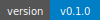
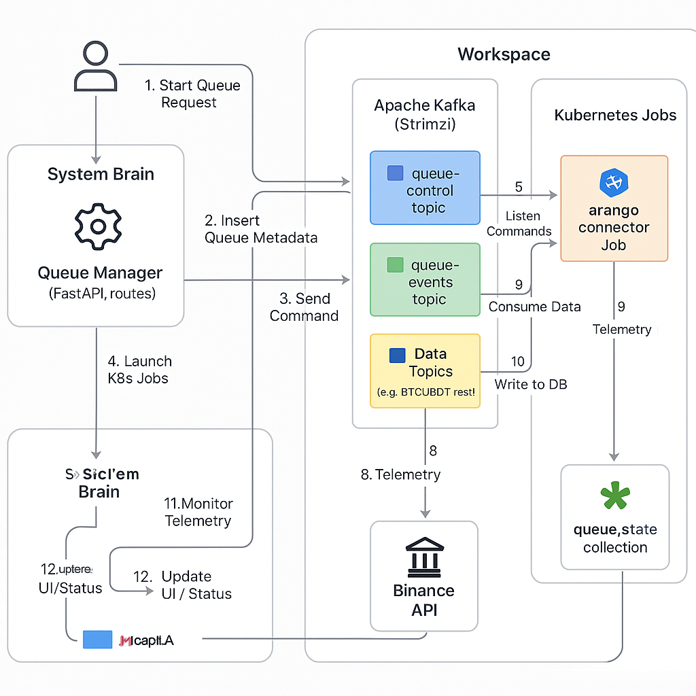

### Status service

| Service | Version | Build | Test | Deploy |
| :--- | :---: | :---: | :--: | :----: |
| **queue-manager** |  |  |  |  |
| **dummy-service** |  |  |  |  |
| **arango-connector** |  |  |  |  |
| **loader-api-candles** |  |  |  |  |
| **loader-api-trades** |  |  |  |  |

## Статус Сервисов

| Сервис             | Статус Сборки                                                                 | Версия                                                                    |
| :----------------- | :---------------------------------------------------------------------------- | :------------------------------------------------------------------------ |
| `arango-connector` |            |    |
| `queue-manager`    |                  |          |
| `loader-api-trades`|          |  |
| `loader-api-candles`|        | |
| `dummy-service`    |                  |          |

# StreamForge: A High-Performance, Event-Driven Platform for Real-Time Cryptocurrency Data Analytics

**StreamForge** is an advanced, event-driven platform engineered for the high-throughput ingestion, processing, and analysis of real-time cryptocurrency market data. Built on a foundation of modern Cloud-Native technologies and architectural patterns, StreamForge delivers a scalable, resilient, and flexible solution for tackling the unique challenges of the digital asset landscape.

## Architecture Overview

## 1.1. The Challenge of Cryptocurrency Data

In the fast-paced world of digital assets, cryptocurrency data is the lifeblood of analytics and automated decision-making. This data is characterized by extreme volatility, 24/7 availability, and immense volume, encompassing everything from high-frequency trades to continuous order book updates. These characteristics demand a new generation of data pipelines—ones that are not only high-performance but also exceptionally reliable.

Key technical hurdles include:
- **Heterogeneous Data Ingestion:** Integrating disparate data streams from a multitude of sources, including REST APIs for historical data and WebSocket feeds for real-time market events.
- **Extreme Scalability:** Architecting a system capable of processing massive, bursty data streams without introducing latency.
- **Data Integrity and Fault Tolerance:** Ensuring guaranteed data delivery and designing for rapid, automated recovery from component failures.
- **Complex Workflow Orchestration:** Managing sophisticated, multi-stage data processing workflows, such as a "load -> persist -> build graph -> train model" sequence, in a coordinated and reliable manner.

## 1.2. The StreamForge Solution: A Decoupled, Event-Driven Architecture

StreamForge is architected as a fully event-driven platform, designed from the ground up for maximum efficiency and resilience. The core principle is the complete decoupling of of services through a central nervous system: **Apache Kafka**. Instead of direct, brittle service-to-service calls, components communicate asynchronously. Each microservice is a self-contained unit that publishes events (its work

The application of this approach guarantees high scalability, adaptability to changing requirements, and increased fault tolerance of the entire system.

## 1.3. Project Mission

1.  **Creation of a Unified Data Source:** Consolidating the processes of collecting, verifying, and storing market data to ensure prompt and convenient access to high-quality information.
2.  **Formation of an Innovative Environment for Data Science:** Providing a specialized platform for the development, testing, and validation of analytical models, including advanced Graph Neural Network (GNN) architectures.
3.  **Building a Reliable Foundation for Algorithmic Trading:** Developing a high-performance and fault-tolerant data pipeline, critically important for the functioning of automated trading systems.
4.  **Comprehensive Process Automation:** Minimizing manual intervention at all stages of the data lifecycle, from collection to analytical processing, to enhance operational efficiency.

## 1.4. Practical Use Cases

- **Scenario 1: Model Training on Historical Data.**
  - **Objective:** Train a GNN model on retrospective transaction data and aggregated 5-minute candles for the `BTCUSDT` trading pair over the last monthly period.
  - **Method:** A full data processing cycle is activated via `queue-manager`. Tasks are executed by Kubernetes Jobs: `loader-producer` loads data into Apache Kafka, `arango-connector` ensures its persistent storage in ArangoDB, `graph-builder` forms the graph structure, and `gnn-trainer` performs model training.

- **Scenario 2: Real-time Market Monitoring.**
  - **Objective:** Obtain streaming data on transactions and order book state in real-time for the `ETHUSDT` trading pair.
  - **Method:** The `loader-ws` module establishes a connection with WebSocket and transmits data to Apache Kafka. The developing visualization module subscribes to the relevant topics to display data on an interactive dashboard.

- **Scenario 3: Rapid Data Analysis.**
  - **Objective:** Verify a hypothesis regarding the correlation between trading volumes and market volatility.
  - **Method:** Using `Jupyter Server` to establish a connection with ArangoDB and conduct analytical research based on data already aggregated and processed by the StreamForge system.

These powerful functionalities make StreamForge an indispensable tool for anyone striving for maximum efficiency in working with cryptocurrency data.

# StreamForge Table of Contents

## [Part II: Architecture and Functioning](docs/StreamForge_II_Architecture_and_Functioning.md)
### [Chapter 2: High-Level Architecture](docs/StreamForge_II_Architecture_and_Functioning.md#chapter-2-high-level-architecture)
- [2.1. Core Architectural Principles](docs/StreamForge_II_Architecture_and_Functioning.md#21-core-architectural-principles)
- [2.2. Data Flow in the System](docs/StreamForge_II_Architecture_and_Functioning.md#22-data-flow-in-the-system)
### [Chapter 3: Apache Kafka as a Central Component](docs/StreamForge_II_Architecture_and_Functioning.md#chapter-3-apache-kafka-as-a-central-component)
- [Topic `queue-control`](docs/StreamForge_II_Architecture_and_Functioning.md#topic-queue-control)
- [Topic `queue-events`](docs/StreamForge_II_Architecture_and_Functioning.md#topic-queue-events)
### [Chapter 4: Microservices](docs/StreamForge_II_Architecture_and_Functioning.md#chapter-4-microservices)
- [4.1. `queue-manager`: The Orchestration Engine](docs/StreamForge_II_Architecture_and_Functioning.md#41-queue-manager-the-orchestration-engine)
- [4.2. Data Collection: `loader-*`: Data Ingestion Services](docs/StreamForge_II_Architecture_and_Functioning.md#42-data-collection-loader--data-ingestion-services)
- [4.3. Data Storage: `arango-connector` — The Persistence Service](docs/StreamForge_II_Architecture_and_Functioning.md#43-data-storage-arango-connector--the-persistence-service)
- [4.4. Analytical Layer: `graph-builder` & `gnn-trainer` — The Analytics and ML Core](docs/StreamForge_II_Architecture_and_Functioning.md#44-analytical-layer-graph-builder--gnn-trainer--the-analytics-and-ml-core)
- [4.5. `dummy-service`: A Diagnostic and Testing Utility](docs/StreamForge_II_Architecture_and_Functioning.md#45-dummy-service-a-diagnostic-and-testing-utility)

## [Part III: Infrastructure and Environment](docs/StreamForge_III_Infrastructure_and_Environment.md)
### [Chapter 5: Platform Fundamentals: Kubernetes and Virtualization](docs/StreamForge_III_Infrastructure_and_Environment.md#chapter-5-platform-fundamentals-kubernetes-and-virtualization)
- [5.1. Foundation: Proxmox VE](docs/StreamForge_III_Infrastructure_and_Environment.md#51-foundation-proxmox-ve)
- [5.2. Cluster Deployment: Kubespray](docs/StreamForge_III_Infrastructure_and_Environment.md#52-cluster-deployment-kubespray)
- [5.3. Network Infrastructure](docs/StreamForge_III_Infrastructure_and_Environment.md#53-network-infrastructure)
- [5.4. Ingress and Gateway API: Traffic Management](docs/StreamForge_III_Infrastructure_and_Environment.md#54-ingress-and-gateway-api-traffic-management)
- [5.5. DNS and TLS](docs/StreamForge_III_Infrastructure_and_Environment.md#55-dns-and-tls)
### [Chapter 6: Data Management: Storage and Access Strategies](docs/StreamForge_III_Infrastructure_and_Environment.md#chapter-6-data-management-storage-and-access-strategies)
- [6.1. Overview of Storage Solutions](docs/StreamForge_III_Infrastructure_and_Environment.md#61-overview-of-storage-solutions)
- [6.2. Object Storage Minio](docs/StreamForge_III_Infrastructure_and_Environment.md#62-object-storage-minio)
### [Chapter 7: Data Platform: Information Management](docs/StreamForge_III_Infrastructure_and_Environment.md#chapter-7-data-platform-information-management)
- [7.1. Strimzi Kafka Operator](docs/StreamForge_III_Infrastructure_and_Environment.md#71-strimzi-kafka-operator)
- [7.2. ArangoDB: Multi-Model Database](docs/StreamForge_III_Infrastructure_and_Environment.md#72-arangodb-multi-model-database)
- [7.3. PostgreSQL (Zalando Operator)](docs/StreamForge_III_Infrastructure_and_Environment.md#73-postgresql-zalando-operator)
- [7.4. Autoscaling with KEDA](docs/StreamForge_III_Infrastructure_and_Environment.md#74-autoscaling-with-keda)
- [7.5. Kafka UI](docs/StreamForge_III_Infrastructure_and_Environment.md#75-kafka-ui)
### [Chapter 8: Monitoring and Observability: Comprehensive System Control](docs/StreamForge_III_Infrastructure_and_Environment.md#chapter-8-monitoring-and-observability-comprehensive-system-control)
- [8.1. Metrics: Prometheus, NodeExporter, cAdvisor](docs/StreamForge_III_Infrastructure_and_Environment.md#81-metrics-prometheus-nodeexporter-cadvisor)
- [8.2. Logs: Fluent-bit, Elasticsearch, Kibana](docs/StreamForge_III_Infrastructure_and_Environment.md#82-logs-fluent-bit-elasticsearch-kibana)
- [8.3. Grafana and Alertmanager](docs/StreamForge_III_Infrastructure_and_Environment.md#83-grafana-and-alertmanager)
### [Chapter 9: Automation and GitOps: Optimizing Deployment Processes](docs/StreamForge_III_Infrastructure_and_Environment.md#chapter-9-automation-and-gitops-optimizing-deployment-processes)
- [9.1. GitLab Runner](docs/StreamForge_III_Infrastructure_and_Environment.md#91-gitlab-runner)
- [9.2. ArgoCD](docs/StreamForge_III_Infrastructure_and_Environment.md#92-argocd)
- [9.3. Reloader](docs/StreamForge_III_Infrastructure_and_Environment.md#93-reloader)
### [Chapter 10: Security and Additional Capabilities](docs/StreamForge_III_Infrastructure_and_Environment.md#chapter-10-security-and-additional-capabilities)
- [10.1. HashiCorp Vault](docs/StreamForge_III_Infrastructure_and_Environment.md#101-hashicorp-vault)
- [10.2. Keycloak](docs/StreamForge_III_Infrastructure_and_Environment.md#102-keycloak)
- [10.3. NVIDIA GPU Operator](docs/StreamForge_III_Infrastructure_and_Environment.md#103-nvidia-gpu-operator)
- [10.4. Other Utilities](docs/StreamForge_III_Infrastructure_and_Environment.md#104-other-utilities)

## [Part IV: Future Prospects: StreamForge Roadmap](docs/StreamForge_IV_What_Next_My_Development_Plans.md)
### [Chapter 11: Self-Healing Engine: Application-Aware Automated Recovery](docs/StreamForge_IV_What_Next_My_Development_Plans.md#chapter-11-self-healing-engine-application-aware-automated-recovery)
### [Chapter 12: Chaos Engineering: System Resilience Verification](docs/StreamForge_IV_What_Next_My_Development_Plans.md#chapter-12-chaos-engineering-system-resilience-verification)
### [Chapter 13: Progressive Delivery: Safe Deployment Strategies](docs/StreamForge_IV_What_Next_My_Development_Plans.md#chapter-13-progressive-delivery-safe-deployment-strategies)

## [Part V: Technical Details and Appendices](docs/StreamForge_V_Technical_Details_and_Appendices.md)
### [Appendix A: Data Schemas and API](docs/StreamForge_V_Technical_Details_and_Appendices.md#appendix-a-data-schemas-and-api)
### [Appendix B: Kubernetes Manifest Examples](docs/StreamForge_V_Technical_Details_and_Appendices.md#appendix-b-kubernetes-manifest-examples)
### [Appendix C: CI/CD Pipeline Examples](docs/StreamForge_V_Technical_Details_and_Appendices.md#appendix-c-cicd-pipeline-examples)
### [Appendix D: Glossary of Terms](docs/StreamForge_V_Technical_Details_and_Appendices.md#appendix-d-glossary-of-terms)
### [Appendix E: Deployment and Operations Guide](docs/StreamForge_V_Technical_Details_and_Appendices.md#appendix-e-deployment-and-operations-guide)
### [Appendix F: Testing Procedure](docs/StreamForge_V_Technical_Details_and_Appendices.md#appendix-f-testing-procedure)
### [Appendix G: Kafka Resource Management](docs/StreamForge_V_Technical_Details_and_Appendices.md#appendix-g-kafka-resource-management)
### [Appendix H: Kubernetes Debugging Environment](docs/StreamForge_V_Technical_Details_and_Appendices.md#appendix-h-kubernetes-debugging-environment)
