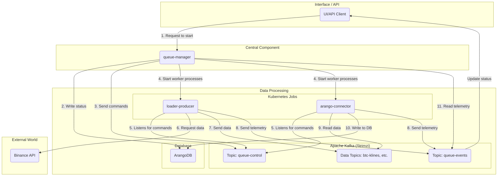

## Part II: Architecture and Functioning

### Chapter 2: High-Level Architecture

#### 2.1. Core Architectural Principles

The StreamForge architecture is based on advanced principles that ensure exceptional flexibility, reliability, and scalability of the system:

1.  **Decoupling through an Event-Driven Model:**
    Tight coupling between components is minimized through the strategic use of Apache Kafka as a central message broker. `queue-manager` initiates task execution (e.g., loading BTC data), which is then processed by corresponding microservices, such as `loader-producer`, when resources are available. This approach guarantees independent development and horizontal scaling of each microservice without compromising the overall integrity and functionality of the system.

2.  **Scalability:**
    The platform is designed to dynamically adapt to changing loads. Stateless applications (`loader-*`, `arango-connector`, and others) are implemented as Kubernetes Jobs, which provides automatic scaling of worker processes. In the near future, integration of **KEDA (Kubernetes Event-driven Autoscaling)** is planned to optimize load management based on Apache Kafka metrics.

3.  **Observability:**
    Comprehensive monitoring tools are an integral part of the StreamForge distributed architecture:
    *   **Metrics:** Microservices export metrics to Prometheus, which are then visualized in Grafana. This includes both system-level indicators (CPU, memory) and business metrics (number of processed records, latencies).
    *   **Logging:** Centralized log collection is carried out using Fluent-bit, with subsequent analysis and visualization in Elasticsearch and Kibana.
    *   **Telemetry (Business Tracing):** A specialized `queue-events` topic is designed to track the full lifecycle of each task, recording its state from initiation to completion or error occurrence across all levels of microservice interaction.

#### 2.2. Data Flow in the System

Below is a simplified diagram illustrating the data flow in the StreamForge system during a historical data loading operation:



**Step-by-step process description:**
1.  **Task Initiation:** The user initiates task execution by sending the corresponding command to `queue-manager` via the user interface or programmatic API.
2.  **Task Status Registration:** A record for the new task is created in the ArangoDB database with an initial "pending" status.
3.  **Control Command Transfer:** `queue-manager` publishes a "start" control signal to the specialized `queue-control` topic in Apache Kafka.
4.  **Activation of Computing Components:** The Kubernetes system activates the necessary microservices (`loader-producer`, `arango-connector`) as temporary jobs for task execution.
5.  **Command Reception by Worker Components:** Activated microservices receive the "start" command from the `queue-control` topic.
6.  **Data Loading by `loader-producer`:** The `loader-producer` module requests data from an external API, e.g., Binance API.
7.  **Data Publication by `loader-producer`:** The received data is published to the corresponding Apache Kafka topic (e.g., `btc-klines-1m`).
8.  **Telemetry Sending:** `loader` and `arango-connector` modules regularly send reports on their current status and progress to the `queue-events` topic.
9.  **Data Reading by `arango-connector`:** The `arango-connector` service retrieves data from the corresponding Apache Kafka topic.
10. **Persistent Data Storage by `arango-connector`:** The extracted information is written to the ArangoDB database.
11. **`queue-manager` Monitoring:** `queue-manager` monitors the task execution process by reading messages from the `queue-events` topic and updates the task status in real-time.

### Chapter 3: Apache Kafka as a Central Component

Apache Kafka holds a central position in the StreamForge architecture, providing a number of key advantages inherent in an event-driven model:

*   **Component Autonomy:** The `loader-producer` and `arango-connector` modules operate independently of each other. The `loader` publishes data to Kafka without needing to wait for immediate processing, which ensures asynchronous interaction and high throughput.
*   **Fault Tolerance:** In the event of temporary failures or consumer unavailability, messages are stored in Kafka, guaranteeing data integrity and the possibility of subsequent processing after service recovery.
*   **Flexibility and Extensibility:** The architecture allows for easy integration of new data handlers, for example, for sending notifications to Telegram, by creating a microservice, subscribed to the relevant Kafka topic.

Orchestration and monitoring of StreamForge are organized around two service topics:

##### Topic `queue-control`
*   **Purpose:** The primary channel for transmitting commands from `queue-manager` to services.
*   **Initiator:** Exclusively `queue-manager`.
*   **Recipients:** All computational components (`loader-*`, `arango-connector`, and others).
*   **Example message:**
    ```json
    {
      "command": "start",
      "queue_id": "wf-btcusdt-api_candles_5m-20240801-a1b2c3",
      "target": "loader-producer",
      "symbol": "BTCUSDT",
      "type": "api_candles_5m",
      "time_range": "2024-08-01:2024-08-02",
      "kafka_topic": "wf-btcusdt-api_candles_5m-20240801-a1b2c3-data",
      "collection_name": "btcusdt_api_candles_5m_2024_08_01",
      "telemetry_id": "loader-producer__a1b2c3",
      "image": "registry.dmz.home/streamforge/loader-producer:v0.2.0",
      "timestamp": 1722500000.123
    }
    ```

##### Topic `queue-events`
*   **Purpose:** The reporting channel for task execution by all services.
*   **Initiator:** All computational components.
*   **Recipients:** `queue-manager`, which monitors the execution process to update statuses.
*   **Example message:**
    ```json
    {
      "queue_id": "wf-btcusdt-api_candles_5m-20240801-a1b2c3",
      "producer": "arango-connector__a1b2c3",
      "symbol": "BTCUSDT",
      "type": "api_candles_5m",
      "status": "loading",
      "message": "Saved 15000 records",
      "records_written": 15000,
      "finished": false,
      "timestamp": 1722500125.456
    }
    ```

### Chapter 4: Microservices

StreamForge is a complex system consisting of specialized microservices, each performing a unique and clearly defined function.

#### 4.1. `queue-manager`: Central Control Component

`queue-manager` is the key control component of the system, ensuring centralized interaction and coordination. Its main functions include:
*   **Task Orchestration:** Managing the full lifecycle of tasks, from initiation to completion.
*   **Progress Monitoring:** Tracking the current status and progress of tasks.
*   **Kubernetes Integration:** Dynamic launching and management of worker processes in the Kubernetes cluster.
*   **Reporting:** Providing detailed information on the status and results of task execution.

**Technologies:** Python, FastAPI (for API implementation), Pydantic, `python-kubernetes`, `aiokafka`, ArangoDB.

#### 4.2. Data Collection: `loader-*`: Modules for Data Ingestion

The `loader-*` family of modules is responsible for timely and efficient data delivery into the system. They extract information from external sources and publish it to Apache Kafka:

*   **`loader-producer`:** A basic module designed for high-performance bulk data loading.
*   **`loader-api-*`:** Specialized modules for working with historical data via REST API.
*   **`loader-ws-*`:** Modules processing real-time streaming data via WebSocket connections.

Each module is configured via environment variables, interacts with the `queue-control` topic to receive commands, and sends status reports to the `queue-events` topic.

**Technologies:** Python, `aiohttp` (for REST), `websockets` (for WebSocket), `aiokafka`, `uvloop`, `orjson`.

#### 4.3. Data Storage: `arango-connector` — Persistence Component

The `arango-connector` service acts as a bridge between Apache Kafka and the ArangoDB graph database, ensuring reliable and efficient data storage:
*   **Data Extraction:** Consumption of messages from relevant Kafka topics.
*   **Storage Optimization:** Aggregation of data and its storage in ArangoDB with performance optimization in mind.
*   **Intelligent Saving:** Uses UPSERT operations to prevent duplicate records.
*   **Error Handling:** Logging of incorrect or corrupted data while maintaining service continuity.

**Technologies:** Python, `aioarango`, `aiokafka`.

#### 4.4. Analytical Layer: `graph-builder` and `gnn-trainer` — Analytics and Machine Learning Core

These components form the analytical and machine learning core of the StreamForge system:

*   **`graph-builder`:** Transforms incoming data into graph structures suitable for subsequent analysis.
*   **`gnn-trainer`:** Trains Graph Neural Network (GNN) models based on the formed graphs.

**Technologies:** Python, `aioarango`, `PyTorch`, `PyTorch Geometric (PyG)`, `minio-py`.

#### 4.5. `dummy-service`: Auxiliary Tool for Testing

`dummy-service` is developed as an auxiliary tool for testing and simulation. It allows verifying connections to Apache Kafka and simulating various load scenarios to assess system performance.

**Technologies:** Python, FastAPI, `aiokafka`, `loguru`, `prometheus_client`.
