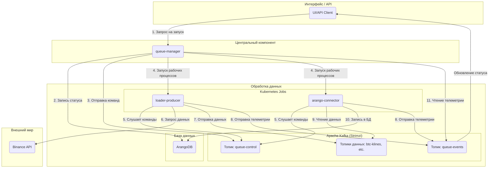

## Часть II: Архитектура и функционирование

### Глава 2: Высокоуровневая архитектура

#### 2.1. Основные принципы архитектуры

Архитектура StreamForge базируется на передовых принципах, обеспечивающих исключительную гибкость, надежность и масштабируемость системы:

1.  **Декаплинг посредством событийной модели:**
    Жесткая связность между компонентами минимизируется за счет стратегического использования Apache Kafka в качестве центрального брокера сообщений. `queue-manager` инициирует выполнение задач (например, загрузку данных по BTC), которые затем обрабатываются соответствующими микросервисами, такими как `loader-producer`, при наличии доступных ресурсов. Данный подход гарантирует независимое развитие и горизонтальное масштабирование каждого микросервиса без нарушения общей целостности и функциональности системы.

2.  **Масштабируемость:**
    Платформа спроектирована с учетом динамической адаптации к изменяющимся нагрузкам. Stateless-приложения (`loader-*`, `arango-connector` и другие) реализуются в виде Kubernetes Jobs, что обеспечивает автоматическое масштабирование рабочих процессов. В ближайшей перспективе планируется интеграция **KEDA (Kubernetes Event-driven Autoscaling)** для оптимизации управления нагрузкой на основе метрик Apache Kafka.

3.  **Наблюдаемость (Observability):**
    Комплексные инструменты мониторинга являются неотъемлемой частью распределенной архитектуры StreamForge:
    *   **Метрики:** Микросервисы экспортируют метрики в Prometheus, которые затем визуализируются в Grafana. Это включает как системные показатели (CPU, память), так и бизнес-метрики (количество обработанных записей, задержки).
    *   **Логирование:** Централизованный сбор логов осуществляется посредством Fluent-bit, с последующим анализом и визуализацией в Elasticsearch и Kibana.
    *   **Телеметрия (Бизнес-трейсинг):** Специализированный топик `queue-events` предназначен для отслеживания полного жизненного цикла каждой задачи, фиксируя ее состояние от инициации до завершения или возникновения ошибок на всех уровнях взаимодействия микросервисов.

#### 2.2. Поток данных в системе

Ниже представлена упрощенная диаграмма, иллюстрирующая поток данных в системе StreamForge при выполнении операции исторической загрузки:



**Пошаговое описание процесса:**
1.  **Инициирование задачи:** Пользователь инициирует выполнение задачи, направляя соответствующую команду `queue-manager` через пользовательский интерфейс или программный API.
2.  **Регистрация статуса задачи:** В базе данных ArangoDB создается запись о новой задаче с начальным статусом "в ожидании" (pending).
3.  **Передача управляющей команды:** `queue-manager` публикует управляющий сигнал "старт" в специализированный топик `queue-control` в Apache Kafka.
4.  **Активация вычислительных компонентов:** Система Kubernetes активирует необходимые микросервисы (`loader-producer`, `arango-connector`) в виде временных заданий (Jobs) для выполнения поставленной задачи.
5.  **Прием команд рабочими компонентами:** Активированные микросервисы получают команду "старт" из топика `queue-control`.
6.  **Загрузка данных `loader-producer`:** Модуль `loader-producer` осуществляет запрос данных к внешнему API, например, Binance API.
7.  **Публикация данных `loader-producer`:** Полученные данные публикуются в соответствующий топик Apache Kafka (например, `btc-klines-1m`).
8.  **Отправка телеметрии:** Модули `loader` и `arango-connector` регулярно отправляют отчеты о своем текущем статусе и ходе выполнения в топик `queue-events`.
9.  **Чтение данных `arango-connector`:** Сервис `arango-connector` извлекает данные из соответствующего топика Apache Kafka.
10. **Персистентное хранение данных `arango-connector`:** Извлеченная информация записывается в базу данных ArangoDB.
11. **Мониторинг `queue-manager`:** `queue-manager` отслеживает процесс выполнения задачи, считывая сообщения из топика `queue-events`, и обновляет статус задачи в реальном времени.

### Глава 3: Apache Kafka как центральный компонент

Apache Kafka занимает центральное место в архитектуре StreamForge, предоставляя ряд ключевых преимуществ, присущих событийно-ориентированной модели:

*   **Автономность компонентов:** Модули `loader-producer` и `arango-connector` функционируют независимо друг от друга. `loader` публикует данные в Kafka без необходимости ожидания их немедленной обработки, что обеспечивает асинхронное взаимодействие и высокую пропускную способность.
*   **Устойчивость к сбоям:** В случае временных сбоев или недоступности потребителей, сообщения сохраняются в Kafka, гарантируя целостность данных и возможность их последующей обработки после восстановления сервиса.
*   **Гибкость и расширяемость:** Архитектура позволяет легко интегрировать новые обработчики данных, например, для отправки уведомлений в Telegram, путем создания микросервиса, подписанного на соответствующий топик Kafka.

Оркестрация и мониторинг StreamForge организованы вокруг двух служебных топиков:

##### Топик `queue-control`
*   **Назначение:** Основной канал передачи команд от `queue-manager` к сервисам.
*   **Инициатор:** Исключительно `queue-manager`.
*   **Получатели:** Все расчетные компоненты (`loader-*`, `arango-connector` и другие).
*   **Пример сообщения:**
    ```json
    {
      "command": "start",
      "queue_id": "wf-btcusdt-api_candles_5m-20240801-a1b2c3",
      "target": "loader-producer",
      "symbol": "BTCUSDT",
      "type": "api_candles_5m",
      "time_range": "2024-08-01:2024-08-02",
      "kafka_topic": "wf-btcusdt-api_candles_5m-20240801-a1b2c3-data",
      "collection_name": "btcusdt_api_candles_5m_2024_08_01",
      "telemetry_id": "loader-producer__a1b2c3",
      "image": "registry.dmz.home/streamforge/loader-producer:v0.2.0",
      "timestamp": 1722500000.123
    }
    ```

##### Топик `queue-events`
*   **Назначение:** Канал отчетности выполнения задач всеми сервисами.
*   **Инициатор:** Все расчетные компоненты.
*   **Получатели:** `queue-manager`, отслеживающий процесс выполнения для обновления статусов.
*   **Пример сообщения:**
    ```json
    {
      "queue_id": "wf-btcusdt-api_candles_5m-20240801-a1b2c3",
      "producer": "arango-connector__a1b2c3",
      "symbol": "BTCUSDT",
      "type": "api_candles_5m",
      "status": "loading",
      "message": "Сохранено 15000 записей",
      "records_written": 15000,
      "finished": false,
      "timestamp": 1722500125.456
    }
    ```

### Глава 4: Микросервисы

StreamForge представляет собой комплексную систему, состоящую из специализированных микросервисов, каждый из которых выполняет уникальную и четко определенную функцию.

#### 4.1. `queue-manager`: Центральный компонент управления

`queue-manager` является ключевым управляющим компонентом системы, обеспечивающим централизованное взаимодействие и координацию. Его основные функции включают:
*   **Организация выполнения задач:** Управление полным жизненным циклом задач, от инициации до завершения.
*   **Контроль прогресса:** Мониторинг текущего состояния и хода выполнения задач.
*   **Интеграция с Kubernetes:** Динамический запуск и управление рабочими процессами в кластере Kubernetes.
*   **Отчетность:** Предоставление детализированной информации о статусе и результатах выполнения задач.

**Технологии:** Python, FastAPI (для реализации API), Pydantic, `python-kubernetes`, `aiokafka`, ArangoDB.

#### 4.2. Сбор данных: `loader-*`: Модули для ингестации данных

Семейство модулей `loader-*` отвечает за своевременную и эффективную доставку данных в систему. Они извлекают информацию из внешних источников и публикуют ее в Apache Kafka:

*   **`loader-producer`:** Базовый модуль, предназначенный для высокопроизводительной массовой загрузки данных.
*   **`loader-api-*`:** Специализированные модули для работы с историческими данными посредством REST API.
*   **`loader-ws-*`:** Модули, обрабатывающие потоковые данные в реальном времени через WebSocket-соединения.

Каждый модуль конфигурируется через переменные окружения, взаимодействует с топиком `queue-control` для получения команд и отправляет отчеты о своем состоянии в топик `queue-events`.

**Технологии:** Python, `aiohttp` (для REST), `websockets` (для WebSocket), `aiokafka`, `uvloop`, `orjson`.

#### 4.3. Хранилище данных: `arango-connector` — Компонент персистентности

Сервис `arango-connector` выступает в качестве связующего звена между Apache Kafka и графовой базой данных ArangoDB, обеспечивая надежное и эффективное хранение данных:
*   **Извлечение данных:** Потребление сообщений из соответствующих топиков Kafka.
*   **Оптимизация хранения:** Агрегация данных и их сохранение в ArangoDB с учетом оптимизации производительности.
*   **Интеллектуальное сохранение:** Использование операции UPSERT для предотвращения дублирования записей.
*   **Обработка ошибок:** Логирование некорректных или поврежденных данных с сохранением непрерывности работы сервиса.

**Технологии:** Python, `aioarango`, `aiokafka`.

#### 4.4. Аналитический слой: `graph-builder` и `gnn-trainer` — Ядро аналитики и машинного обучения

Эти компоненты формируют аналитическое и машинное обучение ядро системы StreamForge:

*   **`graph-builder`:** Преобразует входящие данные в графовые структуры, пригодные для последующего анализа.
*   **`gnn-trainer`:** Осуществляет обучение моделей графовых нейронных сетей (GNN) на основе сформированных графов.

**Технологии:** Python, `aioarango`, `PyTorch`, `PyTorch Geometric (PyG)`, `minio-py`.

#### 4.5. `dummy-service`: Вспомогательный инструмент для тестирования

`dummy-service` разработан как вспомогательный инструмент для тестирования и симуляции. Он позволяет верифицировать соединения с Apache Kafka и имитировать различные сценарии нагрузки для оценки производительности системы.

**Технологии:** Python, FastAPI, `aiokafka`, `loguru`, `prometheus_client`.
