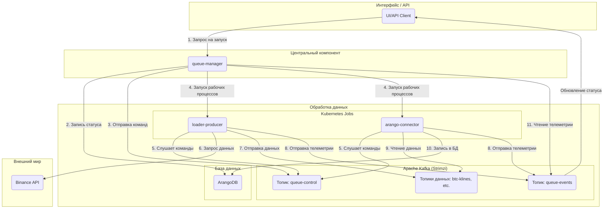

## Часть II: Архитектура и функционирование

### Глава 2: Высокоуровневая архитектура

#### 2.1. Основные принципы архитектуры

Архитектура StreamForge базируется на следующих принципах, обеспечивающих гибкость, надежность и расширяемость:

1.  **Декаплинг через события:**
    Отсутствие жесткой связи. Все компоненты общаются через Kafka. `queue-manager` инициирует задачи, например, запрос на загрузку данных по BTC. `loader-producer` (при наличии свободных ресурсов) подхватывает эту задачу. Это позволяет независимо разрабатывать, обновлять и масштабировать каждый микросервис, не нарушая работу остальной системы.

2.  **Масштабируемость:**
    Платформа спроектирована для легкого масштабирования. Рабочие компоненты (`loader-*`, `arango-connector` и другие) — это stateless-приложения, которые запускаются как Kubernetes Jobs. При необходимости обработки большего объема данных, `queue-manager` запускает дополнительные Jobs. В будущем планируется использовать **KEDA** для автоматического масштабирования в зависимости от нагрузки на Kafka.

3.  **Наблюдаемость:**
    Понимание состояния распределенной системы является критически важным. В StreamForge используются три столпа наблюдаемости:
    *   **Метрики:** Каждый микросервис отправляет метрики в Prometheus, которые визуализируются в Grafana. Это позволяет отслеживать как технические параметры (CPU, память), так и бизнес-метрики (количество обработанных записей, задержки).
    *   **Логи:** Все логи собираются централизованно с помощью `Fluent-bit` и отправляются в Elasticsearch для поиска и анализа через Kibana.
    *   **Телеметрия (Бизнес-трейсинг):** Специальный топик `queue-events` позволяет отслеживать весь жизненный цикл каждой задачи — от старта до завершения или ошибки, проходя через все микросервисы.

#### 2.2. Поток данных в системе

Ниже представлена упрощенная схема, демонстрирующая поток данных в системе при запуске исторической загрузки:



**Пошаговое описание процесса:**
1.  **Инициирование задачи:** Через интерфейс или API пользователь отправляет команду `queue-manager` для запуска задачи.
2.  **Запись статуса задачи:** `queue-manager` создает запись о новой задаче в базе данных (ArangoDB) со статусом "в ожидании".
3.  **Отправка команды:** `queue-manager` отправляет команду "старт" в специальный топик `queue-control` в Kafka.
4.  **Запуск рабочих компонентов:** `queue-manager` через Kubernetes запускает необходимые микросервисы (`loader-producer`, `arango-connector`) как временные задачи (Jobs).
5.  **Получение команд рабочими компонентами:** Запущенные микросервисы получают команду "старт" из `queue-control`.
6.  **Загрузка данных `loader-producer`:** `loader-producer` обращается к Binance API.
7.  **Отправка данных `loader-producer`:** Полученные данные отправляются в соответствующий топик в Kafka (например, `btc-klines-1m`).
8.  **Отправка телеметрии:** `loader` и `arango-connector` периодически отправляют события о своем статусе (например, "загружаю", "записано 1000 записей") в топик `queue-events`.
9.  **Чтение данных `arango-connector`:** `arango-connector` забирает данные из топика.
10. **Сохранение данных `arango-connector`:** Данные записываются в ArangoDB.
11. **Мониторинг `queue-manager`:** `queue-manager` слушает `queue-events` для обновления статуса задачи и отображения прогресса в реальном времени.

## Глава 3: Kafka: Центральный компонент системы

Apache Kafka выбран в качестве центрального компонента проекта. Событийно-ориентированная архитектура предоставляет следующие преимущества:

*   **Независимость:** Компоненты загрузки данных (`loader-producer`) и сохранения данных (`arango-connector`) функционируют независимо. `loader` отправляет данные в Kafka, не ожидая их обработки, что позволяет `arango-connector` обрабатывать их асинхронно.
*   **Надежность:** В случае отказа сервиса сообщения не теряются — они сохраняются в Kafka до тех пор, пока сервис не восстановится и не продолжит работу.
*   **Гибкость:** Добавление нового обработчика данных (например, для уведомлений в Telegram) осуществляется путем создания нового микросервиса, который подписывается на соответствующий топик.

Вся оркестрация и мониторинг в StreamForge построены на двух служебных топиках:

##### Топик `queue-control`
*   **Назначение:** `queue-manager` отправляет команды другим сервисам.
*   **Инициатор:** Только `queue-manager`.
*   **Получатели:** Все рабочие компоненты (`loader-*`, `arango-connector` и т.д.).
*   **Пример сообщения:**
    ```json
    {
      "command": "start",
      "queue_id": "wf-btcusdt-api_candles_5m-20240801-a1b2c3",
      "target": "loader-producer",
      "symbol": "BTCUSDT",
      "type": "api_candles_5m",
      "time_range": "2024-08-01:2024-08-02",
      "kafka_topic": "wf-btcusdt-api_candles_5m-20240801-a1b2c3-data",
      "collection_name": "btcusdt_api_candles_5m_2024_08_01",
      "telemetry_id": "loader-producer__a1b2c3",
      "image": "registry.dmz.home/streamforge/loader-producer:v0.2.0",
      "timestamp": 1722500000.123
    }
    ```

##### Топик `queue-events`
*   **Назначение:** Все сервисы отправляют отчеты о своей работе.
*   **Инициатор:** Все рабочие компоненты.
*   **Получатели:** `queue-manager` (для обновления статусов и отображения прогресса).
*   **Пример сообщения:**
    ```json
    {
      "queue_id": "wf-btcusdt-api_candles_5m-20240801-a1b2c3",
      "producer": "arango-connector__a1b2c3",
      "symbol": "BTCUSDT",
      "type": "api_candles_5m",
      "status": "loading",
      "message": "Сохранено 15000 записей",
      "records_written": 15000,
      "finished": false,
      "timestamp": 1722500125.456
    }
    ```

## Глава 4: Микросервисы

StreamForge состоит из набора микросервисов, каждый из которых выполняет определенную функцию.

#### 4.1. `queue-manager`: Мозг всей операции

Это главный босс. Единственный, с кем я (или другие приложения) общаюсь напрямую. Он отвечает за:
*   **Запуск задач:** Я говорю ему, что нужно сделать, а он все организует.
*   **Отслеживание прогресса:** Он знает, на каком этапе находится каждая задача.
*   **Общение с Kubernetes:** Он запускает новые "рабочие лошадки" в моем кластере.
*   **Отчетность:** Показывает мне, как идут дела.

**Технологии:** Python, FastAPI (для API), Pydantic, `python-kubernetes`, `aiokafka`, ArangoDB.

#### 4.2. Слой сбора данных: Семейство `loader-*` (Мои "качалки")

Эти ребята отвечают за то, чтобы данные попадали в систему. Они берут данные из внешних источников (например, Binance) и отправляют их в Kafka. Они работают как временные задачи в Kubernetes.

*   **`loader-producer` (базовый):** Универсальный загрузчик данных. Очень быстрый, использует `asyncio` и `uvloop`.
*   **`loader-api-*` (например, `loader-api-candles`, `loader-api-trades`):** Специализируются на исторических данных через REST API.
*   **`loader-ws-*` (например, `loader-ws-orderbook`):** Работают с данными в реальном времени через WebSocket.

Все они получают настройки через переменные окружения, слушают `queue-control` и отправляют подробные отчеты в `queue-events`.

**Технологии:** Python, `aiohttp` (для REST), `websockets` (для WebSocket), `aiokafka`, `uvloop`, `orjson`.

#### 4.3. Слой хранения данных: `arango-connector` (Мой "склад")

Этот сервис — мост между Kafka и моей базой данных ArangoDB. Он:
*   **Читает данные:** Забирает сообщения из Kafka.
*   **Сохраняет пачками:** Накапливает данные и записывает их в ArangoDB большими порциями, чтобы было быстрее.
*   **Умное сохранение:** Использует `UPSERT`, чтобы не было дубликатов, даже если сообщение пришло повторно.
*   **Обработка ошибок:** Если что-то пошло не так (например, "битый" JSON), он это логирует и продолжает работать.

**Технологии:** Python, `aioarango`, `aiokafka`.

#### 4.4. Аналитический слой: `graph-builder` и `gnn-trainer` (Мои "аналитики")

Это самая "умная" часть проекта, где происходит магия данных и машинного обучения.

*   **`graph-builder`:** Превращает обычные данные (свечи, сделки) в графы. Он ищет связи между активами и строит граф, который потом используется для обучения моделей.
*   **`gnn-trainer`:** Обучает модели графовых нейронных сетей (GNN). Он берет граф, обучает на нем модель (например, для прогнозирования цены) и сохраняет результаты в MinIO.

**Технологии:** Python, `aioarango`, `PyTorch`, `PyTorch Geometric (PyG)`, `minio-py`.

#### 4.5. `dummy-service`: Мой "подопытный кролик" для тестов

`dummy-service` — это специальный сервис для тестирования и симуляции. Он может притворяться другими сервисами, проверять связь с Kafka, имитировать нагрузку и ошибки. Очень полезен для отладки!

**Технологии:** Python, FastAPI, `aiokafka`, `loguru`, `prometheus_client`.