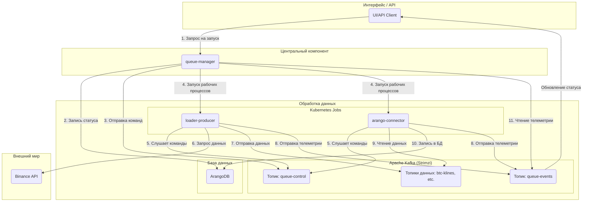

# StreamForge: Платформа для обработки криптовалютных данных

Данный документ описывает проект **StreamForge** — платформу для сбора, обработки и анализа криптовалютных данных в реальном времени. Проект разработан с использованием современных Cloud Native технологий.

## Часть I: Предпосылки и цели проекта

### 1.1. Проблема: Особенности криптовалютных данных

Криптовалютные данные характеризуются высокой волатильностью, круглосуточной доступностью и значительными объемами генерации (обновления книги ордеров, тысячи сделок в секунду, минутные свечи). Это создает сложности в их сборе, обработке и извлечении значимой информации.

Основные сложности включали:
*   **Много источников:** Данные поступают как по REST API (для исторических данных), так и по WebSocket (для данных в реальном времени), что требует интеграции различных источников.
*   **Масштаб и скорость:** Система должна выдерживать пиковые нагрузки и обрабатывать большие потоки данных без потерь.
*   **Надежность:** Необходимо обеспечить сохранность данных и быстрое восстановление системы в случае сбоев.
*   **Сложность оркестрации:** Для запуска сложных последовательностей задач, таких как «загрузка -> сохранение -> построение графа -> обучение модели», требовалась надежная система оркестрации.

### 1.2. Концепция: Событийно-ориентированная платформа

В основе **StreamForge** лежит концепция событийно-ориентированной платформы для обработки данных.

Основной принцип архитектуры — отсутствие прямых вызовов между сервисами. Взаимодействие осуществляется через брокер сообщений **Apache Kafka**. Каждый сервис публикует информацию в общую шину, а другие сервисы, заинтересованные в этих данных, подписываются на соответствующие топики. Такой подход обеспечивает гибкость, независимость и взаимозаменяемость компонентов. `queue-manager` выступает в роли оркестратора, объявляя о задачах, которые затем подхватываются соответствующими исполнителями.

Это способствует масштабируемости, адаптивности и отказоустойчивости системы.

### 1.3. Цели проекта

1.  **Создание единого источника данных:** Централизованный сбор, очистка и хранение рыночных данных для обеспечения быстрого и удобного доступа.
2.  **Среда для Data Science:** Предоставление окружения для разработки и тестирования моделей, включая графовые нейронные сети (GNN).
3.  **Основа для алгоритмической торговли:** Построение производительного и надежного конвейера данных в качестве фундамента для торговых систем.
4.  **Автоматизация процессов:** Минимизация ручных операций в процессах сбора и анализа данных.

### 1.4. Практические сценарии использования

*   **Сценарий 1: Обучение модели на исторических данных.**
    *   **Задача:** Обучить GNN-модель на данных по сделкам и 5-минутным свечам для `BTCUSDT` за последний месяц.
    *   **Решение:** Отправляется запрос в `queue-manager`, описывающий весь процесс. Система запускает Kubernetes Jobs: `loader-producer` (загружает данные в Kafka), `arango-connector` (сохраняет в ArangoDB), `graph-builder` (строит граф) и `gnn-trainer` (обучает модель).

*   **Сценарий 2: Мониторинг рынка в реальном времени.**
    *   **Задача:** Получать поток сделок и книгу ордеров для `ETHUSDT` в реальном времени.
    *   **Решение:** Запускается `loader-ws`, который подключается к WebSocket и отправляет данные в Kafka. Визуализатор (в разработке) подписывается на эти данные и отображает их на дашборде.

*   **Сценарий 3: Быстрый анализ данных.**
    *   **Задача:** Проверить гипотезу о корреляции объемов торгов и волатильности.
    *   **Решение:** С помощью `Jupyter Server` (который также является частью системы) выполняется подключение к ArangoDB для анализа данных, которые StreamForge уже собрал и обработал.

## Часть II: Архитектура и функционирование

### Глава 2: Высокоуровневая архитектура

#### 2.1. Основные принципы архитектуры

Архитектура StreamForge базируется на следующих принципах, обеспечивающих гибкость, надежность и расширяемость:

1.  **Декаплинг через события:**
    Отсутствие жесткой связи. Все компоненты общаются через Kafka. `queue-manager` инициирует задачи, например, запрос на загрузку данных по BTC. `loader-producer` (при наличии свободных ресурсов) подхватывает эту задачу. Это позволяет независимо разрабатывать, обновлять и масштабировать каждый микросервис, не нарушая работу остальной системы.

2.  **Масштабируемость:**
    Платформа спроектирована для легкого масштабирования. Рабочие компоненты (`loader-*`, `arango-connector` и другие) — это stateless-приложения, которые запускаются как Kubernetes Jobs. При необходимости обработки большего объема данных, `queue-manager` запускает дополнительные Jobs. В будущем планируется использовать **KEDA** для автоматического масштабирования в зависимости от нагрузки на Kafka.

3.  **Наблюдаемость:**
    Понимание состояния распределенной системы является критически важным. В StreamForge используются три столпа наблюдаемости:
    *   **Метрики:** Каждый микросервис отправляет метрики в Prometheus, которые визуализируются в Grafana. Это позволяет отслеживать как технические параметры (CPU, память), так и бизнес-метрики (количество обработанных записей, задержки).
    *   **Логи:** Все логи собираются централизованно с помощью `Fluent-bit` и отправляются в Elasticsearch для поиска и анализа через Kibana.
    *   **Телеметрия (Бизнес-трейсинг):** Специальный топик `queue-events` позволяет отслеживать весь жизненный цикл каждой задачи — от старта до завершения или ошибки, проходя через все микросервисы.

#### 2.2. Поток данных в системе

Ниже представлена упрощенная схема, демонстрирующая поток данных в системе при запуске исторической загрузки:



**Пошаговое описание процесса:**
1.  **Инициирование задачи:** Через интерфейс или API пользователь отправляет команду `queue-manager` для запуска задачи.
2.  **Запись статуса задачи:** `queue-manager` создает запись о новой задаче в базе данных (ArangoDB) со статусом "в ожидании".
3.  **Отправка команды:** `queue-manager` отправляет команду "старт" в специальный топик `queue-control` в Kafka.
4.  **Запуск рабочих компонентов:** `queue-manager` через Kubernetes запускает необходимые микросервисы (`loader-producer`, `arango-connector`) как временные задачи (Jobs).
5.  **Получение команд рабочими компонентами:** Запущенные микросервисы получают команду "старт" из `queue-control`.
6.  **Загрузка данных `loader-producer`:** `loader-producer` обращается к Binance API.
7.  **Отправка данных `loader-producer`:** Полученные данные отправляются в соответствующий топик в Kafka (например, `btc-klines-1m`).
8.  **Отправка телеметрии:** `loader` и `arango-connector` периодически отправляют события о своем статусе (например, "загружаю", "записано 1000 записей") в топик `queue-events`.
9.  **Чтение данных `arango-connector`:** `arango-connector` забирает данные из топика.
10. **Сохранение данных `arango-connector`:** Данные записываются в ArangoDB.
11. **Мониторинг `queue-manager`:** `queue-manager` слушает `queue-events` для обновления статуса задачи и отображения прогресса в реальном времени.

## Глава 3: Kafka: Центральный компонент системы

Apache Kafka выбран в качестве центрального компонента проекта. Событийно-ориентированная архитектура предоставляет следующие преимущества:

*   **Независимость:** Компоненты загрузки данных (`loader-producer`) и сохранения данных (`arango-connector`) функционируют независимо. `loader` отправляет данные в Kafka, не ожидая их обработки, что позволяет `arango-connector` обрабатывать их асинхронно.
*   **Надежность:** В случае отказа сервиса сообщения не теряются — они сохраняются в Kafka до тех пор, пока сервис не восстановится и не продолжит работу.
*   **Гибкость:** Добавление нового обработчика данных (например, для уведомлений в Telegram) осуществляется путем создания нового микросервиса, который подписывается на соответствующий топик.

Вся оркестрация и мониторинг в StreamForge построены на двух служебных топиках:

##### Топик `queue-control`
*   **Назначение:** `queue-manager` отправляет команды другим сервисам.
*   **Инициатор:** Только `queue-manager`.
*   **Получатели:** Все рабочие компоненты (`loader-*`, `arango-connector` и т.д.).
*   **Пример сообщения:**
    ```json
    {
      "command": "start",
      "queue_id": "wf-btcusdt-api_candles_5m-20240801-a1b2c3",
      "target": "loader-producer",
      "symbol": "BTCUSDT",
      "type": "api_candles_5m",
      "time_range": "2024-08-01:2024-08-02",
      "kafka_topic": "wf-btcusdt-api_candles_5m-20240801-a1b2c3-data",
      "collection_name": "btcusdt_api_candles_5m_2024_08_01",
      "telemetry_id": "loader-producer__a1b2c3",
      "image": "registry.dmz.home/streamforge/loader-producer:v0.2.0",
      "timestamp": 1722500000.123
    }
    ```

##### Топик `queue-events`
*   **Назначение:** Все сервисы отправляют отчеты о своей работе.
*   **Инициатор:** Все рабочие компоненты.
*   **Получатели:** `queue-manager` (для обновления статусов и отображения прогресса).
*   **Пример сообщения:**
    ```json
    {
      "queue_id": "wf-btcusdt-api_candles_5m-20240801-a1b2c3",
      "producer": "arango-connector__a1b2c3",
      "symbol": "BTCUSDT",
      "type": "api_candles_5m",
      "status": "loading",
      "message": "Сохранено 15000 записей",
      "records_written": 15000,
      "finished": false,
      "timestamp": 1722500125.456
    }
    ```

## Глава 4: Микросервисы

StreamForge состоит из набора микросервисов, каждый из которых выполняет определенную функцию.

#### 4.1. `queue-manager`: Мозг всей операции

Это главный босс. Единственный, с кем я (или другие приложения) общаюсь напрямую. Он отвечает за:
*   **Запуск задач:** Я говорю ему, что нужно сделать, а он все организует.
*   **Отслеживание прогресса:** Он знает, на каком этапе находится каждая задача.
*   **Общение с Kubernetes:** Он запускает новые "рабочие лошадки" в моем кластере.
*   **Отчетность:** Показывает мне, как идут дела.

**Технологии:** Python, FastAPI (для API), Pydantic, `python-kubernetes`, `aiokafka`, ArangoDB.

#### 4.2. Слой сбора данных: Семейство `loader-*` (Мои "качалки")

Эти ребята отвечают за то, чтобы данные попадали в систему. Они берут данные из внешних источников (например, Binance) и отправляют их в Kafka. Они работают как временные задачи в Kubernetes.

*   **`loader-producer` (базовый):** Универсальный загрузчик данных. Очень быстрый, использует `asyncio` и `uvloop`.
*   **`loader-api-*` (например, `loader-api-candles`, `loader-api-trades`):** Специализируются на исторических данных через REST API.
*   **`loader-ws-*` (например, `loader-ws-orderbook`):** Работают с данными в реальном времени через WebSocket.

Все они получают настройки через переменные окружения, слушают `queue-control` и отправляют подробные отчеты в `queue-events`.

**Технологии:** Python, `aiohttp` (для REST), `websockets` (для WebSocket), `aiokafka`, `uvloop`, `orjson`.

#### 4.3. Слой хранения данных: `arango-connector` (Мой "склад")

Этот сервис — мост между Kafka и моей базой данных ArangoDB. Он:
*   **Читает данные:** Забирает сообщения из Kafka.
*   **Сохраняет пачками:** Накапливает данные и записывает их в ArangoDB большими порциями, чтобы было быстрее.
*   **Умное сохранение:** Использует `UPSERT`, чтобы не было дубликатов, даже если сообщение пришло повторно.
*   **Обработка ошибок:** Если что-то пошло не так (например, "битый" JSON), он это логирует и продолжает работать.

**Технологии:** Python, `aioarango`, `aiokafka`.

#### 4.4. Аналитический слой: `graph-builder` и `gnn-trainer` (Мои "аналитики")

Это самая "умная" часть проекта, где происходит магия данных и машинного обучения.

*   **`graph-builder`:** Превращает обычные данные (свечи, сделки) в графы. Он ищет связи между активами и строит граф, который потом используется для обучения моделей.
*   **`gnn-trainer`:** Обучает модели графовых нейронных сетей (GNN). Он берет граф, обучает на нем модель (например, для прогнозирования цены) и сохраняет результаты в MinIO.

**Технологии:** Python, `aioarango`, `PyTorch`, `PyTorch Geometric (PyG)`, `minio-py`.

#### 4.5. `dummy-service`: Мой "подопытный кролик" для тестов

`dummy-service` — это специальный сервис для тестирования и симуляции. Он может притворяться другими сервисами, проверять связь с Kafka, имитировать нагрузку и ошибки. Очень полезен для отладки!

**Технологии:** Python, FastAPI, `aiokafka`, `loguru`, `prometheus_client`.

## Часть III: Инфраструктура и окружение

StreamForge развернут на базе Kubernetes-платформы в локальной лаборатории.

### Глава 5: Основы платформы: Kubernetes и виртуализация

(Базовые конфиги для Kubernetes).

#### 5.1. Фундамент: Proxmox VE

Используется `Proxmox VE` для виртуализации. Это позволяет эффективно управлять физическими ресурсами, создавать виртуальные машины для узлов Kubernetes и изолировать окружение.

#### 5.2. Развертывание кластера: Kubespray

Кластер Kubernetes развернут с помощью `Kubespray`. Этот инструмент позволяет автоматизировать и стандартизировать процесс создания production-ready кластера.

#### 5.3. Сетевая инфраструктура

*   **`kube-vip` для высокой доступности:** Для обеспечения высокой доступности Kubernetes API используется `kube-vip`. Он предоставляет виртуальный IP-адрес, который обеспечивает бесперебойную работу в случае отказа одного из управляющих узлов.
*   **`MetalLB` для внешнего доступа:** В лабораторных условиях, где отсутствуют аппаратные балансировщики нагрузки, `MetalLB` (версия `0.14.9`) (Балансировщик нагрузки для моей bare-metal лаборатории) позволяет использовать стандартные Kubernetes-сервисы типа `LoadBalancer` и предоставлять внешние IP-адреса для доступа к приложениям.

#### 5.4. Ingress и Gateway API: Управление трафиком

Для управления внешним трафиком используются два Ingress-контроллера: `Traefik` и `ingress-nginx`. `Traefik` является предпочтительным решением благодаря поддержке нового **Gateway API**, который предоставляет расширенные возможности для маршрутизации трафика. `ingress-nginx` (версия `4.12.1`) установлен в качестве резервного варианта.

**Конфигурация Traefik (версия `36.1.0`):**
*   **Точки входа:**
    *   `web`: HTTP (порт 80), с перенаправлением на HTTPS.
    *   `websecure`: HTTPS (порт 443) с TLS.
    *   `ssh`: TCP (порт 2222).
    *   `kafka`: TCP (порт 9094).
*   **Панель мониторинга:** Доступна по адресу `traefik.dmz.home/dashboard`.
*   **Сертификаты:** Автоматически выпускаются `cert-manager` с помощью `homelab-ca-issuer`.
*   **Хранение:** Используется `1Gi` персистентного хранилища на `nfs-client` для данных ACME.
*   **Внешний IP:** `192.168.1.153`.

#### 5.5. DNS и TLS

*   **`Technitium DNS Server`:** Локальный DNS-сервер, который позволяет обращаться к сервисам по доменным именам (например, `jupyterhub.dmz.home`).
*   **`cert-manager`:** Автоматизирует управление TLS-сертификатами для всех сервисов, обеспечивая безопасность соединений.

##### Скрипт `script.sh` для создания TLS-сертификатов

Скрипт `/platform/base/cert/script.sh` автоматизирует процесс создания и получения TLS-сертификатов с использованием `openssl` и `cert-manager` в среде Kubernetes.

Основные шаги скрипта:
1.  **Настройка переменных**: Определяются параметры, такие как пространство имен Kubernetes, имя сертификата, домен, IP-адрес, срок действия сертификата и директория для сохранения файлов.
2.  **Генерация ключа и CSR**: Используется `openssl` для создания приватного ключа и запроса на подпись сертификата (CSR) с альтернативными именами субъекта (SAN) для доменного имени и IP-адреса.
3.  **Создание CertificateRequest**: CSR кодируется в Base64, и на его основе динамически формируется YAML-манифест для объекта `CertificateRequest` `cert-manager`, который затем применяется к кластеру Kubernetes.
4.  **Ожидание и получение сертификата**: Скрипт ожидает выполнения `CertificateRequest` `cert-manager`'ом. После успешного выполнения извлекает сгенерированный сертификат, декодирует его и сохраняет в файл.
5.  **Проверка**: Выполняются команды `openssl` для проверки соответствия приватного ключа и сертификата, а также для вывода подробной информации о сертификате.

## Глава 6: Где я храню все эти данные?

Надежное хранилище — это очень важно. Я использую несколько решений для разных типов данных:

#### 6.1. Обзор Storage-решений

*   **`Linstor Piraeus` (RWO):** Для баз данных (ArangoDB, PostgreSQL) я использую `Linstor Piraeus`. Это высокопроизводительное блочное хранилище с низкой задержкой.
*   **`GlusterFS` и `NFS Subdir External Provisioner` (RWX):** (Распределенная файловая система для общих томов). Для общих файлов (например, домашние директории JupyterHub) я использую `GlusterFS` и `NFS Subdir External Provisioner` (версия `4.0.18`). Это позволяет нескольким подам одновременно читать и писать в одно и то же хранилище. Мой NFS-сервер находится по адресу `192.168.1.6` и использует путь `/data0/k2`.

#### 6.2. Объектное хранилище Minio

`Minio` — это мой личный S3-совместимый "облачный" склад внутри кластера. Я использую его для:
1.  **Моделей машинного обучения:** `gnn-trainer` сохраняет сюда обученные модели, их веса и метрики.
2.  **Бэкапов:** Здесь хранятся резервные копии всех важных данных.

## Глава 7: Моя платформа данных: Как я управляю информацией

Платформа данных — это сердце StreamForge.

#### 7.1. `Strimzi Kafka Operator`: Мой личный Kafka-менеджер

`Strimzi` (Развертывание Apache Kafka с помощью оператора Strimzi) позволяет мне легко управлять Apache Kafka в Kubernetes. Он автоматизирует все сложные задачи: развертывание, настройку, управление топиками и пользователями, а также обеспечивает высокую доступность.

#### 7.2. Мультимодельная база данных `ArangoDB`

Я выбрал `ArangoDB` из-за ее гибкости. Она может хранить данные как документы (JSON) и как графы, что идеально подходит для моего проекта:
*   **Документы:** Для исторических свечей, сделок и статусов задач.
*   **Графы:** Для анализа связей между активами и обучения GNN-моделей.

#### 7.3. Реляционная база данных `PostgreSQL` (Zalando Operator)

Для более структурированных данных (например, пользовательские настройки) я использую `PostgreSQL`. Оператор от Zalando (Управляет PostgreSQL кластерами) делает управление им очень простым.

#### 7.4. Автомасштабирование с `KEDA`: Экономия ресурсов

`KEDA` позволяет мне автоматически масштабировать количество "рабочих лошадок" в зависимости от нагрузки. Если в Kafka накопилось много сообщений, KEDA запустит больше консьюмеров, а когда нагрузка спадет — уменьшит их количество. Это очень удобно для оптимизации ресурсов!

#### 7.5. kafka-ui: Веб-интерфейс для Kafka

`kafka-ui` — это веб-интерфейс для управления Kafka.

*   **Версия:** `v0.7.2` (образ `provectuslabs/kafka-ui:v0.7.2`)
*   **Доступ:** Доступен через Ingress по адресу `kafka-ui.dmz.home` с использованием `nginx` Ingress-контроллера и TLS-сертификата (`kafka-ui-tls`).
*   **Размещение подов:** Настроен на запуск на узле `k2w-7` с помощью `nodeSelector`.
*   **Реплики:** Развернут в одном экземпляре (`replicaCount: 1`).
*   **Подключение к Kafka:** Подключается к Kafka кластеру `k3` по адресу `k3-kafka-bootstrap.kafka:9093` с использованием `SASL_SSL` и механизма аутентификации `SCRAM-SHA-512` с пользователем `user-streamforge`.

## Глава 8: Все под контролем: Как я слежу за системой

Понимать, что происходит в моей распределенной системе, очень важно.

#### 8.1. Метрики: `Prometheus`, `cAdvisor`, `NodeExporter`

Я использую `Prometheus` для сбора и хранения всех метрик. `NodeExporter` собирает данные с моих серверов, `cAdvisor` — с контейнеров, а каждый мой микросервис отправляет свои собственные метрики.

**Ключевые особенности:**
*   **Версия:** `kube-prometheus-stack-71.1.0`.
*   **Prometheus:** Хранит данные на `20Gi` NFS-хранилище. Доступен через Ingress по адресу `prometheus.dmz.home`.
*   **Alertmanager:** Хранит данные на `500Mi` NFS-хранилище.
*   **Grafana:** Использует `1Gi` NFS-хранилище для персистентности. Доступна через Ingress по адресу `grafana.dmz.home`.
*   Все Ingress-ресурсы защищены TLS-сертификатами, выданными `cert-manager`.

#### 8.2. Логи: `Fluent-bit`, `Elasticsearch`, `Kibana`

(Мой стек для сбора и анализа логов (Elasticsearch, Logstash, Kibana)).
Моя система логирования очень продвинутая. Я собираю как структурированные логи из приложений, так и системные логи с узлов.

**Как это работает:**
1.  **Логи приложений:** Мои приложения отправляют логи напрямую в `Fluent-bit` по сети. `Fluent-bit` использует специальный Lua-скрипт, чтобы динамически создавать индексы в Elasticsearch на основе тегов и даты (например, `internal-my-app-2025.08.06`). Это очень удобно для поиска и управления старыми логами.
2.  **Системные логи:** `Fluent-bit` также собирает логи из `/var/log/syslog`, `/var/log/nginx/access.log` и `/var/log/auth.log`.
3.  **Elasticsearch и Kibana:** `Elasticsearch` хранит и индексирует все логи, а `Kibana` предоставляет удобный веб-интерфейс для их просмотра и анализа. Доступ к Kibana защищен TLS.

**Примеры (для разработчиков):**
*   **Отправка логов из Python:**
    ```python
    from fluent import sender
    import time
    import random
    import json

    APP_NAME = "my-pod-app"

    logger = sender.FluentSender(
        tag='internal.' + APP_NAME, # Важно: тег определяет будущий индекс!
        host='fluent-bit-service.logging.svc.cluster.local',
        port=24224
    )

    log_record = {
        'message': 'User logged in successfully',
        'level': 'INFO',
        'user_id': 12345
    }
    logger.emit('log', log_record)
    ```
*   **Lua-скрипт для Fluent-bit (создание индекса):**
    ```lua
    function cb_set_index(tag, timestamp, record)
        local t = os.time()
        if timestamp and type(timestamp) == "table" and timestamp[1] > 0 then
            t = timestamp[1]
        end

        local prefix = "unknown"
        local app = "unknown"

        local parts = {}
        for part in string.gmatch(tag, "([^"."]+)") do
            table.insert(parts, part)
        end
        if #parts >= 2 then
            prefix = parts[1]
            app = parts[2]
        end

        local date = os.date("%Y.%m.%d", t)
        record["log_index"] = prefix .. "-" .. app .. "-" .. date
        return 1, timestamp, record
    end
    ```

**Инструменты для отладки:**
*   **`test-logger-script`:** Простой Python-скрипт для генерации тестовых логов.
*   **`fluentbit-tailon`:** Специальный инструмент для просмотра "сырых" логов в реальном времени.

#### 8.3. Визуализация и алертинг: `Grafana`, `Alertmanager`

`Grafana` — моя любимая панель для визуализации метрик из Prometheus и логов из Elasticsearch. `Alertmanager` интегрирован с Prometheus и отправляет мне уведомления в Telegram, если что-то идет не так.

## Глава 9: Автоматизация и GitOps: Мой путь к ленивому деплою

Автоматизация сборки, тестирования и развертывания — это основа моей работы.

#### 9.1. `GitLab Runner`: Мой личный CI/CD-помощник

`GitLab Runner` (Запускает мои CI/CD пайплайны в Kubernetes) выполняет все задачи, описанные в `.gitlab-ci.yml`. Я использую `kubernetes` executor, что означает, что для каждой задачи Runner создает отдельный Pod в моем кластере. Для сборки Docker-образов я использую `Kaniko` (без Docker-in-Docker!).

##### 9.1.1. Конфигурация и особенности исполнителя (Runner)

**Общие настройки Runner:**
*   **Исполнитель:** `kubernetes`. Каждый CI/CD job запускается в отдельном Pod'е в неймспейсе `gitlab`.
*   **Привязка к узлу:** Runner запускает поды только на узле `k2w-9`.
*   **Права доступа:** Использует `ServiceAccount` `full-access-sa` и работает в привилегированном режиме.
*   **Образ по умолчанию:** `ubuntu:22.04`.
*   **Ресурсы:** Запрос: 100m CPU, 128Mi RAM. Лимит: 500m CPU, 512Mi RAM.
*   **Кэширование:** Использует распределенное кэширование на базе S3 (мой внутренний Minio на `minio.dmz.home`, бакет `runner-cache`).
*   **Docker Registry:** Секрет `regcred` монтируется для аутентификации с приватными репозиториями.
*   **TLS:** Секрет `home-certificates` монтируется для доверия к внутренним TLS-сертификатам.

**Специфическая конфигурация `stf-runner` (k2m-runner):**
*   **Имя:** `k2m-runner` (в `helm list` он отображается как `stf-runner`).
*   **Версия:** `0.79.0` (приложение `18.2.0`).
*   **URL GitLab:** `https://gitlab.dmz.home/`
*   **Пространство имен Kubernetes:** `gitlab`
*   **Таймаут опроса:** 300 секунд.
*   **Монтирование томов:** `docker-config`, `home-certificates`, `runner-home` (PVC `gitlab-runner-home`).

##### 9.1.2. Структура CI/CD пайплайна

Мой CI/CD пайплайн состоит из нескольких стадий:
*   **`setup`**: Подготовка (например, настройка Kubernetes RBAC).
*   **`build`**: Сборка Docker-образов (использую `Kaniko`).
*   **`test`**: Запуск автоматических тестов.
*   **`deploy`**: Развертывание в Kubernetes.

Задачи запускаются автоматически при изменениях в файлах или вручную.

##### 9.1.3. Детализация конфигурации пайплайнов

Я использую модульный подход с `include` и `extends` в GitLab CI, чтобы не дублировать код.

**Основной файл `.gitlab-ci.yml`:**
Он включает конфигурации для отдельных сервисов и платформы.
```yaml
stages:
  - setup
  - build
  - test
  - deploy

include:
  - '/services/queue-manager/.gitlab-ci.yml'
  - '/services/loader-api-trades/.gitlab-ci.yml'
  - '/services/loader-api-candles/.gitlab-ci.yml'
  - '/services/arango-connector/.gitlab-ci.yml'
  - '/services/dummy-service/.gitlab-ci.yml'
  - 'platform/.gitlab-ci.yml' # Включаем конфигурацию для платформы (базовый образ, RBAC)
```

**Шаблоны CI/CD (`.gitlab/ci-templates/`):**
Общие шаблоны для Python-сервисов.
```yaml
.build_python_service:
  stage: build
  image: gcr.io/kaniko-project/executor:debug
  script:
    - SERVICE_VERSION=$(cat $CI_PROJECT_DIR/$SERVICE_PATH/VERSION)
    - /kaniko/executor
      --context $CI_PROJECT_DIR/$SERVICE_PATH
      --dockerfile Dockerfile
      --destination $CI_REGISTRY_IMAGE/$SERVICE_NAME:$SERVICE_VERSION
  rules:
    - if: '$CI_PIPELINE_SOURCE == "merge_request_event"'
      changes:
        - $SERVICE_PATH/**/*
        - libs/**/*
    - if: '$CI_COMMIT_BRANCH == "main"'
      changes:
        - $SERVICE_PATH/**/*
        - libs/**/*
    - when: manual
      allow_failure: false
```

**Конфигурация для отдельных сервисов:**
Каждый сервис расширяет общий шаблон.
```yaml
include:
  - project: 'kinga/stream-forge'
    ref: main
    file: '/.gitlab/ci-templates/Python-Service.gitlab-ci.yml'

build-dummy-service:
  extends: .build_python_service
  variables:
    SERVICE_NAME: dummy-service
    SERVICE_PATH: services/dummy-service

deploy-dummy-service:
  stage: deploy
  image: bitnami/kubectl:latest
  script:
    - kubectl apply -f $CI_PROJECT_DIR/services/dummy-service/k8s/dummy-service-deployment.yaml
  rules:
    - if: '$CI_COMMIT_BRANCH == "main"'
      when: on_success
```

**Конфигурация для компонентов платформы:**
Аналогично сервисам.
```yaml
include:
  - project: 'kinga/stream-forge'
    ref: main
    file: '/.gitlab/ci-templates/Python-Service.gitlab-ci.yml' # Используем тот же шаблон для сборки базового образа

build-base-image:
  extends: .build_python_service
  variables:
    SERVICE_NAME: base
    SERVICE_PATH: platform # Указываем путь к Dockerfile и VERSION для базового образа

apply-rbac:
  stage: setup
  image: bitnami/kubectl:latest
  script:
    - kubectl apply -f $CI_PROJECT_DIR/input/cred-kafka-yaml/full-access-sa.yaml
    - kubectl apply -f $CI_PROJECT_DIR/input/cred-kafka-yaml/full-access-sa-binding.yaml
  rules:
    - if: '$CI_COMMIT_BRANCH == "main"'
      changes:
        - input/cred-kafka-yaml/full-access-sa.yaml
        - input/cred-kafka-yaml/full-access-sa-binding.yaml
    - if: '$CI_PIPELINE_SOURCE == "merge_request_event"'
      changes:
        - input/cred-kafka-yaml/full-access-sa.yaml
        - input/cred-kafka-yaml/full-access-sa-binding.yaml
    - when: manual
      allow_failure: false
```
Такая структура обеспечивает гибкость, переиспользование и легкую масштабируемость CI/CD пайплайнов в проекте StreamForge.

#### 9.2. `ArgoCD`: Мой GitOps-волшебник

`ArgoCD` (Мой GitOps-инструмент для деплоя в Kubernetes) — это то, что позволяет мне реализовать GitOps. Он постоянно следит за моим Git-репозиторием и синхронизирует состояние кластера с тем, что там описано. Это гарантирует, что мой кластер всегда выглядит так, как я хочу, и позволяет легко откатываться к предыдущим версиям.

**Ключевые особенности моей настройки:**
*   **GitOps-репозиторий:** `iac_kubeadm` (`https://gitlab.dmz.home/infra-a-cod/iac_kubeadm.git`) — это мой "источник правды" для кластера.
*   **Доступ к серверу:** Пока что ArgoCD API-сервер доступен без TLS (для удобства в домашней лабе), но доступ к веб-интерфейсу (`argocd.dmz.home`) защищен.
*   **Отказоустойчивость:** Сейчас все ключевые компоненты ArgoCD работают в одном экземпляре, так что это не высокодоступная конфигурация (но для pet-проекта сойдет!).
*   **CRD:** При удалении чарта ArgoCD, все его Custom Resource Definitions тоже удаляются.
*   **Интеграция с GitLab:** Есть TLS-сертификат для `gitlab.dmz.home`, чтобы ArgoCD мог безопасно подключаться к моим репозиториям.

#### 9.3. `Reloader`: Автоматические перезагрузки

`Reloader` — это маленький, но очень полезный инструмент. Он следит за изменениями в `ConfigMap` и `Secret`. Если я обновляю какой-то конфиг или секрет, `Reloader` автоматически перезапускает связанные с ним приложения, чтобы они подхватили новые настройки. Очень удобно!

## Глава 10: Безопасность и другие фишки

### 10.1. Секреты: `HashiCorp Vault` и `Vault CSI Driver`

Для безопасного хранения паролей, API-ключей и других секретов я использую `HashiCorp Vault`. `Vault CSI Driver` позволяет моим подам получать секреты, монтируя их как временные тома. Это намного безопаснее, чем хранить их в Kubernetes `Secret` объектах.

### 10.2. Аутентификация: `Keycloak`

`Keycloak` (Сервер для управления идентификацией и доступом) — мой центральный сервер для управления пользователями и доступом. Он обеспечивает единый вход (SSO) для всех моих веб-интерфейсов: Grafana, Kibana, ArgoCD и, конечно, будущего UI StreamForge.

### 10.3. Ускорение вычислений: `NVIDIA GPU Operator`

(Поддержка GPU в Kubernetes).
Для задач машинного обучения, которые требуют много вычислительной мощности, я использую `NVIDIA GPU Operator`. Он автоматизирует установку драйверов и других компонентов NVIDIA, делая мои GPU доступными для контейнеров. Это очень важно для эффективного обучения GNN-моделей!

**Ключевые особенности:**
*   **Версия:** `v24.9.2`.
*   **Конфигурация:** Используются стандартные настройки Helm-чарта. Никаких кастомных параметров, что упрощает обновления.
*   **Функциональность:** Оператор сам находит GPU на узлах и делает их доступными для подов.

### 10.4. Прочие утилиты

*   **`kubed`:** Помогает синхронизировать `ConfigMap` и `Secret` между разными неймспейсами.
*   **`Mailrelay`:** Мой центральный SMTP-шлюз для отправки уведомлений (например, от `Alertmanager`).

## Часть IV: Что дальше? Мои планы по развитию

Моя текущая архитектура StreamForge — это отличный фундамент. Вот что я планирую дальше:

### Глава 11: Self-Healing Engine: Автоматическое восстановление

**Цель:** Создать "умного" оператора, который будет сам следить за моими "рабочими лошадками" и перезапускать их, если что-то пойдет не так, даже если это не полный сбой пода.

**Как это будет работать:**
1.  Оператор будет слушать "отчеты" из `queue-events`.
2.  Если от какого-то Job'а долго нет событий или пришла ошибка, оператор поймет, что Job "завис" или "сломался".
3.  Оператор автоматически удалит проблемный Job и запустит новый, чтобы задача продолжилась. Это позволит системе восстанавливаться на уровне бизнес-логики!

### Глава 12: Chaos Engineering: Проверка на прочность

**Цель:** Регулярно и автоматически проверять, насколько моя система устойчива к разным сбоям.

**Примеры экспериментов, которые я планирую:**
*   **`pod-delete`:** Случайное удаление подов `loader-*` или `arango-connector`, чтобы убедиться, что мой Self-Healing оператор их корректно перезапускает.
*   **`network-latency`:** Искусственное создание задержек в сети между микросервисами и Kafka, чтобы проверить, как система справляется с плохой связью.
*   **`kafka-broker-failure`:** Имитация отказа одного из брокеров Kafka, чтобы проверить отказоустойчивость, которую обеспечивает Strimzi.

### Глава 13: Progressive Delivery: Безопасные обновления

**Цель:** Минимизировать риски при обновлении критически важных компонентов, таких как `queue-manager`.

**Как это будет работать (Canary-релиз с `Argo Rollouts`):**
1.  `Argo Rollouts` развернет новую версию `queue-manager` рядом со старой и направит на нее небольшой процент трафика (например, 10%).
2.  Он будет следить за метриками новой версии.
3.  Если все хорошо, `Argo Rollouts` постепенно увеличит трафик до 100%. Если метрики ухудшатся, он автоматически откатится к старой, стабильной версии.

## Часть V: Технические детали для любопытных

### Приложение А: Схемы данных и API

(Здесь будут все технические спецификации API для `queue-manager` и подробные JSON-схемы для сообщений Kafka. Это для тех, кто любит копаться в деталях!)

### Приложение Б: Примеры манифестов Kubernetes

#### Пример: Kubernetes Job для `arango-candles`

```yaml
apiVersion: batch/v1
kind: Job
metadata:
  name: job-arango-candles-btcusdt-abc123
  namespace: stf
  labels:
    app: streamforge
    queue_id: "wf-btcusdt-api_candles_1m-20240801-abc123"
spec:
  template:
    spec:
      restartPolicy: Never
      containers:
        - name: arango-candles
          image: registry.dmz.home/streamforge/arango-candles:v0.1.5
          env:
            - name: QUEUE_ID
              value: "wf-btcusdt-api_candles_1m-20240801-abc123"
            - name: SYMBOL
              value: "BTCUSDT"
            - name: TYPE
              value: "api_candles_1m"
            - name: KAFKA_TOPIC
              value: "wf-btcusdt-api_candles_1m-20240801-abc123-data"
            - name: COLLECTION_NAME
              value: "btcusdt_api_candles_1m_2024_08_01"
            # ... прочие переменные из ConfigMap и Secret ...
      nodeSelector:
        streamforge-worker: "true" # Пример селектора для выделенных нод
  backoffLimit: 2
  ttlSecondsAfterFinished: 3600
```

### Приложение В: Примеры CI/CD пайплайнов

(Здесь будут полные `.gitlab-ci.yml` файлы для каждого микросервиса, показывающие, как я тестирую, собираю и деплою.)

### Приложение Г: Глоссарий терминов

(Здесь будут определения всех умных слов, которые я использовал: Workflow, Job, Декаплинг, Идемпотентность и т.д.)

### Приложение Д: Руководство по развертыванию и эксплуатации

(Пошаговые инструкции, как развернуть всю платформу с нуля, а также как ее мониторить, делать бэкапы и обновлять.)

### Приложение F: Процедура тестирования

Для проверки работоспособности системы я использую `dummy-service` и `debug_producer.py`. Эти инструменты особенно эффективны в моей стандартизированной среде разработки `devcontainer`.

**1. `dummy-service`: Мой тестовый микросервис для симуляции**

Он может притворяться другими сервисами, проверять связь с Kafka и имитировать нагрузку.

*   **Запуск:** Запускаю его в Kubernetes как `Job` или `Pod`. Для локального тестирования в `devcontainer` использую:
    ```bash
    python3.11 -m app.main --debug --simulate-loading
    ```
*   **Подробнее:** См. `services/dummy-service/README.md`.

**2. `debug_producer.py`: Мой инструмент для отправки команд и проверки ответов**

Это CLI-инструмент для отправки тестовых команд (`ping`, `stop`) в Kafka и проверки ответов.

*   **Тестирование связности Kafka (ping/pong):**
    ```bash
    python3.11 services/dummy-service/debug_producer.py \
      --queue-id <your-queue-id> \
      --command ping \
      --expect-pong
    ```
*   **Тестирование команды остановки (stop):**
    ```bash
    python3.11 services/dummy-service/debug_producer.py \
      --queue-id <your-queue-id> \
      --command stop
    ```
*   **Тестирование имитации загрузки и отслеживания статуса:** Запускаю `dummy-service` с `--simulate-loading` и слежу за событиями в `queue-events`.
*   **Тестирование симуляции сбоя:** Запускаю `dummy-service` с `--fail-after N` и смотрю, как он отправляет `error` события.
*   **Тестирование Prometheus-метрик:** Проверяю метрики через `curl localhost:8000/metrics`.

**3. `devcontainer`: Моя стандартизированная среда разработки**

`devcontainer` — это Docker-контейнер, который дает мне полноценную среду разработки, интегрированную с VS Code. Это гарантирует, что у всех разработчиков одинаковое окружение.

**Ключевые особенности:**
*   **Базовый образ:** Ubuntu 22.04 LTS.
*   **Инструменты:** `kubectl`, Helm, `gitlab-runner`, `git`, `curl`, `ssh` и другие.
*   **Доступ к Kubernetes:** Автоматически настраивается.
*   **Пользователи и SSH:** Создается отдельный пользователь и настраивается SSH-доступ.
*   **Сертификаты:** Устанавливаются CA-сертификаты для доверия к внутренним сервисам.

**Как использовать:**
1.  Установить Docker Desktop и расширение "Dev Containers" для VS Code.
2.  Открыть проект StreamForge в VS Code и выбрать "Reopen in Container".
3.  VS Code сам соберет образ и запустит контейнер.

### Приложение G: Управление ресурсами Kafka

Мои манифесты Kubernetes в `cred-kafka-yaml/` позволяют декларативно управлять ресурсами Kafka через оператор Strimzi. Это включает создание топиков (`queue-control`, `queue-events`), пользователей Kafka (`user-streamforge`) и их прав доступа, а также хранение учетных данных.

### Приложение H: Среда отладки в Kubernetes

Для отладки и взаимодействия с кластером Kubernetes я использую:

*   **JupyterHub:** Позволяет запускать интерактивные сессии Jupyter Notebook прямо в кластере (Моя платформа для интерактивных ноутбуков). Мои образы ноутбуков уже содержат `kubectl`, `helm` и другие инструменты.

    **Ключевые особенности моей настройки JupyterHub:**
    *   **Управление неактивными серверами:** Автоматически завершает неактивные серверы Jupyter.
    *   **Аутентификация:** Используется простая "фиктивная" аутентификация для тестовой среды.
    *   **База данных Hub:** Используется `sqlite-memory`, но данные сохраняются на хосте.
    *   **Размещение подов:** Hub и пользовательские серверы запускаются на узле `k2w-8`.
    *   **Доступ:** Через Ingress по адресу `jupyterhub.dmz.home` с TLS.
    *   **Образы пользовательских серверов:** Используется кастомный образ `registry.dmz.home/streamforge/core-modules/jupyter-python311:v0.0.2` с нужными инструментами.
    *   **Ресурсы:** Гарантированный объем памяти для каждого сервера — `1G`.
    *   **Хранилище данных:** Используются персистентные тома, монтируемые с хоста, для `/home/`, `/data/project`, `/data/venv`.
    *   **Безопасность:** Поды запускаются с `UID: 1001` и `FSGID: 100`.
    *   **Docker Registry:** Используется секрет `regcred` для аутентификации.

*   **Dev Container (VS Code):** Подробно описан выше.

*   **Dev-контейнер (общий):** Это Docker-образ с широким набором инструментов (`kubectl`, `helm`, `kafkacat`, `python`), который можно использовать для запуска временных подов в Kubernetes для интерактивной отладки).