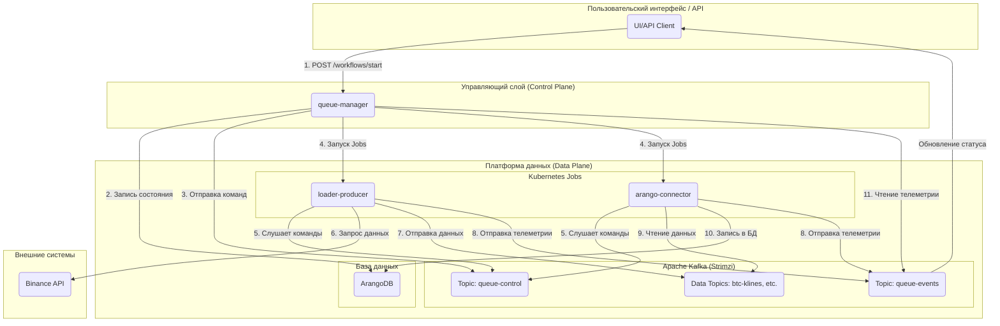

# Технический Документ Проекта StreamForge (Версия 2.0)

# Содержание

# Часть I: Введение и Бизнес-Контекст

# Глава 1: Общее Описание Проекта StreamForge

### **1.1. Проблема: Сложность и Волатильность Потоков Крипто-Данных**

Функционирование на рынках криптовалют сопряжено с рядом фундаментальных вызовов, обусловленных их специфической динамикой. В отличие от традиционных финансовых рынков, крипто-данные характеризуются экстремальной волатильностью, непрерывным торговым циклом (24/7) и значительным объемом генерируемой информации. Потоки данных, такие как обновления книги ордеров (order book), транзакционные тики (trades) и агрегированные свечи (klines), продуцируются с высокой частотой, требуя обработки в режиме, приближенном к реальному времени.

Разработка надежной системы для агрегации, обработки и анализа подобных данных требует решения следующих критических задач:
*   **Управление Множественными Источниками:** Необходимость одновременной интеграции различных типов данных, поступающих как посредством REST API (для исторических срезов), так и через протокол WebSocket (для потоков реального времени).
*   **Масштабируемость и Производительность:** Система должна демонстрировать способность к обработке пиковых нагрузок в периоды повышенной рыночной активности без компрометации целостности данных.
*   **Надежность и Отказоустойчивость:** Временные сбои отдельных компонентов (например, модулей загрузки данных или коннекторов к базам данных) не должны приводить к потере данных или нарушению функционирования всей системы.
*   **Сложность Оркестрации:** Инициация и управление комплексными, многоэтапными задачами, такими как "загрузка данных -> персистентное хранение в БД -> построение графовой структуры -> обучение модели", требуют сложной логики управления зависимостями и мониторинга состояния.

### **1.2. Видение: Создание Интеллектуальной, Событийно-Управляемой Аналитической Платформы**

Проект **StreamForge** представляет собой ответ на вышеуказанные вызовы. Наше видение заключается в создании не просто набора инструментальных средств для сбора данных, а целостной, интеллектуальной и **событийно-управляемой (event-driven)** платформы.

Архитектура системы базируется на принципе **декаплинга (decoupling)**: компоненты системы не взаимодействуют напрямую посредством синхронных API-вызовов. Вместо этого, коммуникация осуществляется асинхронно через брокер сообщений **Apache Kafka**. Данный подход обеспечивает независимость, автономность и легкую заменяемость каждого микросервиса. Центральный оркестратор (`queue-manager`) не выдает прямых директив, а лишь декларирует намерения в общем информационном пространстве, на которые реагируют соответствующие исполнители.

Это позволяет построить адаптивную систему, способную к саморегуляции, масштабированию и эволюции без прерывания ее функционирования.

### **1.3. Ключевые Цели и Бизнес-Ценность**

1.  **Формирование Надежного Источника Данных (Single Source of Truth):** Централизация процессов сбора, очистки и хранения рыночных данных, обеспечивающая единую, консистентную точку доступа для всех последующих аналитических и прикладных систем.
2.  **Платформа для Количественных Исследований:** Предоставление дата-сайентистам и аналитикам готовой среды для разработки и валидации сложных аналитических моделей, включая графовые нейронные сети (GNN).
3.  **Основа для Алгоритмической Торговли:** Создание высокопроизводительного конвейера данных с низкой задержкой, который может служить фундаментом для разработки и эксплуатации торговых алгоритмов.
4.  **Снижение Операционных Издержек:** Автоматизация процессов загрузки, обработки и анализа данных, минимизирующая необходимость ручного вмешательства.

### **1.4. Основные Сценарии Использования**

*   **Сценарий 1: Историческая Загрузка для Обучения Модели.**
    *   **Задача:** Аналитик инициирует обучение GNN-модели на данных по транзакциям и 5-минутным свечам для торговой пары `BTCUSDT` за последний месяц.
    *   **Решение:** Пользователь посредством пользовательского интерфейса (UI) или программного интерфейса (API) отправляет в `queue-manager` единый запрос, описывающий весь рабочий процесс (workflow). Система автоматически инициирует Kubernetes Jobs для `loader-producer` (загрузка данных в Kafka), `arango-connector` (персистентное хранение в ArangoDB), `graph-builder` (построение графовой структуры) и `gnn-trainer` (обучение модели).

*   **Сценарий 2: Мониторинг Рынка в Реальном Времени.**
    *   **Задача:** Трейдер осуществляет мониторинг потока транзакций и состояния книги ордеров для торговой пары `ETHUSDT` в реальном времени.
    *   **Решение:** Запускается рабочий процесс с `loader-ws` (подписка на WebSocket), который поставляет данные в Kafka. Сервис `visualizer` подписывается на соответствующие топики и отображает данные на дашборде.

*   **Сценарий 3: Ad-hoc Анализ Данных.**
    *   **Задача:** Дата-сайентист проводит проверку гипотезы, связанной с корреляцией объемов торгов и волатильности.
    *   **Решение:** Используя `Jupyter Server`, интегрированный с платформой, аналитик может напрямую выполнять запросы к данным, хранящимся в ArangoDB, которые были агрегированы и обработаны StreamForge.

# Часть II: Архитектура Приложения StreamForge

### **Глава 2: Высокоуровневая Архитектура Приложения**

#### **2.1. Ключевые Принципы**

Архитектура StreamForge базируется на трех фундаментальных принципах, обеспечивающих ее гибкость, надежность и адаптивность к будущим требованиям.

1.  **Декаплинг посредством Событий:**
    Компоненты системы характеризуются слабой связностью. Вместо прямых API-вызовов, создающих жесткие зависимости, все взаимодействие осуществляется асинхронно через брокер сообщений Kafka. `queue-manager` не обладает информацией о местоположении или способе запуска `loader-producer`; он лишь публикует "команду" в топик `queue-control`. Любой воркер, соответствующий заданным критериям, может принять эту команду в обработку. Это обеспечивает независимую разработку, обновление и масштабирование каждого микросервиса без воздействия на другие части системы.

2.  **Масштабируемость:**
    Платформа спроектирована для горизонтального масштабирования. Воркеры (`loader-*`, `arango-connector` и др.) представляют собой stateless-приложения, запускаемые в виде Kubernetes Jobs. При увеличении нагрузки (например, при необходимости одновременной загрузки данных по сотням торговых пар) `queue-manager` инициирует создание большего количества Jobs. Использование партиций в Kafka позволяет распараллелить обработку данных, а интеграция с **KEDA** (Kubernetes Event-driven Autoscaling) в перспективе обеспечит автоматическое масштабирование количества консьюмеров в зависимости от длины очереди в топике.

3.  **Наблюдаемость (Observability):**
    Понимание состояния распределенной системы является критически важным. В StreamForge наблюдаемость обеспечивается тремя ключевыми аспектами:
    *   **Метрики:** Каждый микросервис экспортирует метрики в формате Prometheus, которые агрегируются и визуализируются в Grafana. Это позволяет отслеживать как технические параметры (CPU, память), так и бизнес-метрики (количество обработанных записей, задержки).
    *   **Логи:** Все логи централизованно собираются с помощью `Fluent-bit` и направляются в `Elasticsearch`, где доступны для анализа и поиска через `Kibana`.
    *   **Телеметрия (Бизнес-Трейсинг):** Топик `queue-events` функционирует как система распределенного трейсинга на уровне бизнес-логики. Он позволяет отслеживать жизненный цикл каждой задачи от момента ее создания до успешного завершения или возникновения ошибки, проходя через все задействованные микросервисы.

#### **2.2. Архитектурная Схема и Поток Данных**

Ниже представлена схема, иллюстрирующая взаимодействие ключевых компонентов системы в рамках выполнения задачи по исторической загрузке данных.

**Описание Потока Данных (Workflow):**
1.  **Инициация:** Пользователь посредством UI или API инициирует запрос на запуск рабочего процесса в `queue-manager`.
2.  **Сохранение Состояния:** `queue-manager` создает запись о новом рабочем процессе в своей базе данных (ArangoDB) со статусом `pending`.
3.  **Декларация Намерения:** `queue-manager` формирует и отправляет команду `start` в топик `queue-control`.
4.  **Запуск Исполнителей:** `queue-manager` через Kubernetes API создает `Job` для каждого необходимого микросервиса (`loader-producer`, `arango-connector`).
5.  **Получение Команды:** Запущенные микросервисы подписываются на `queue-control` и получают команду `start`.
6.  **Сбор Данных:** `loader-producer` обращается к API Binance для получения данных.
7.  **Публикация Данных:** `loader-producer` отправляет полученные данные в соответствующий топик данных в Kafka (например, `btc-klines-1m`).
8.  **Отправка Телеметрии:** Оба воркера (`loader` и `arango-connector`) периодически отправляют события о своем статусе (например, `loading`, `records_written: 1000`) в топик `queue-events`.
9.  **Потребление Данных:** `arango-connector` считывает данные из топика.
10. **Сохранение Данных:** `arango-connector` записывает данные в целевую коллекцию в ArangoDB.
11. **Обратная Связь:** `queue-manager` прослушивает топик `queue-events` для обновления статуса рабочего процесса в своей базе данных и трансляции его в UI посредством WebSocket.

