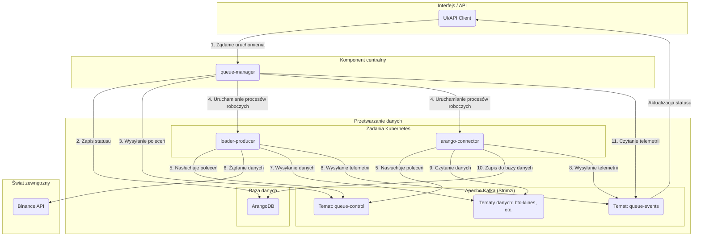

# StreamForge: Platforma do przetwarzania danych kryptowalutowych

Niniejszy dokument opisuje projekt **StreamForge** — platformę do zbierania, przetwarzania i analizy danych kryptowalutowych w czasie rzeczywistym. Projekt został opracowany z wykorzystaniem nowoczesnych technologii Cloud Native.

## Część I: Przesłanki i cele projektu

### 1.1. Problem: Specyfika danych kryptowalutowych

Dane kryptowalutowe charakteryzują się dużą zmiennością, całodobową dostępnością i znacznymi wolumenami generacji (aktualizacje księgi zleceń, tysiące transakcji na sekundę, minutowe świece). Stwarza to trudności w ich zbieraniu, przetwarzaniu i wydobywaniu istotnych informacji.

Główne trudności obejmowały:
*   **Wiele źródeł:** Dane поступают zarówno przez REST API (dla danych historycznych), jak i przez WebSocket (dla danych w czasie rzeczywistym), co wymaga integracji różnych źródeł.
*   **Skala i szybkość:** System musi wytrzymywać szczytowe obciążenia i przetwarzać duże strumienie danych bez strat.
*   **Niezawodność:** Należy zapewnić integralność danych i szybkie odzyskiwanie systemu w przypadku awarii.
*   **Złożoność orkiestracji:** Do uruchamiania złożonych sekwencji zadań, takich jak „ładowanie -> zapis -> budowanie grafu -> uczenie modelu”, wymagany był niezawodny system orkiestracji.

### 1.2. Koncepcja: Platforma zorientowana na zdarzenia

U podstaw **StreamForge** leży koncepcja platformy zorientowanej na zdarzenia do przetwarzania danych.

Główną zasadą architektury jest brak bezpośrednich wywołań między usługami. Interakcja odbywa się za pośrednictwem brokera wiadomości **Apache Kafka**. Każda usługa publikuje informacje na wspólnej szynie, a inne usługi, zainteresowane tymi danymi, subskrybują odpowiednie tematy. Takie podejście zapewnia elastyczność, niezależność i wymienność komponentów. `queue-manager` pełni rolę orkiestratora, ogłaszając zadania, które następnie są podejmowane przez odpowiednich wykonawców.

Przyczynia się to do skalowalności, adaptacyjności i odporności systemu na awarie.

### 1.3. Cele projektu

1.  **Stworzenie jednego źródła danych:** Scentralizowane zbieranie, czyszczenie i przechowywanie danych rynkowych w celu zapewnienia szybkiego i wygodnego dostępu.
2.  **Środowisko dla Data Science:** Zapewnienie środowiska do разработки i testowania modeli, w tym grafowych sieci neuronowych (GNN).
3.  **Podstawa dla handlu algorytmicznego:** Budowa wydajnego i niezawodnego potoku danych jako fundamentu dla systemów handlowych.
4.  **Automatyzacja procesów:** Minimalizacja operacji ręcznych w procesach zbierania i analizy danych.

### 1.4. Praktyczne scenariusze użycia

*   **Scenariusz 1: Uczenie modelu na danych historycznych.**
    *   **Zadanie:** Nauczyć model GNN na danych o transakcjach i 5-minutowych świecach dla `BTCUSDT` za ostatni miesiąc.
    *   **Rozwiązanie:** Wysyłane jest żądanie do `queue-manager`, opisujące cały proces. System uruchamia zadania Kubernetes: `loader-producer` (ładuje dane do Kafki), `arango-connector` (zapisuje w ArangoDB), `graph-builder` (buduje graf) i `gnn-trainer` (uczy model).

*   **Scenariusz 2: Monitorowanie rynku w czasie rzeczywistym.**
    *   **Zadanie:** Otrzymywać strumień transakcji i księgę zleceń dla `ETHUSDT` w czasie rzeczywistym.
    *   **Rozwiązanie:** Uruchamiany jest `loader-ws`, który łączy się z WebSocket i wysyła dane do Kafki. Wizualizator (w trakcie разработки) subskrybuje te dane i wyświetla je na pulpicie nawigacyjnym.

*   **Scenariusz 3: Szybka analiza danych.**
    *   **Zadanie:** Sprawdzić hipotezę o korelacji wolumenów handlu i zmienności.
    *   **Rozwiązanie:** Za pomocą `Jupyter Server` (który również jest częścią systemu) nawiązywane jest połączenie z ArangoDB w celu analizy danych, które StreamForge już zebrał i przetworzył.

## Część II: Architektura i funkcjonowanie

### Rozdział 2: Architektura wysokiego poziomu

#### 2.1. Główne zasady architektury

Architektura StreamForge opiera się na następujących zasadach, zapewniających elastyczność, niezawodność i rozszerzalność:

1.  **Dekapling poprzez zdarzenia:**
    Brak sztywnych powiązań. Wszystkie komponenty komunikują się przez Kafkę. `queue-manager` inicjuje zadania, na przykład żądanie załadowania danych dla BTC. `loader-producer` (jeśli są dostępne zasoby) podejmuje to zadanie. Pozwala to na niezależne rozwijanie, aktualizowanie i skalowanie każdej mikrousługi bez zakłócania pracy reszty systemu.

2.  **Skalowalność:**
    Platforma została zaprojektowana z myślą o łatwym skalowaniu. Komponenty robocze (`loader-*`, `arango-connector` i inne) to aplikacje bezstanowe, które są uruchamiane jako zadania Kubernetes. W razie potrzeby przetwarzania większej ilości danych, `queue-manager` uruchamia dodatkowe zadania. W przyszłości planowane jest użycie **KEDA** do automatycznego skalowania w zależności od obciążenia Kafki.

3.  **Obserwowalność:**
    Zrozumienie stanu systemu rozproszonego jest kluczowe. W StreamForge wykorzystywane są trzy filary obserwowalności:
    *   **Metryki:** Każda mikrousługa wysyła metryki do Prometheus, które są wizualizowane w Grafanie. Pozwala to na śledzenie zarówno parametrów technicznych (CPU, pamięć), jak i metryk biznesowych (liczba przetworzonych rekordów, opóźnienia).
    *   **Logi:** Wszystkie logi są zbierane centralnie za pomocą `Fluent-bit` i wysyłane do Elasticsearch w celu wyszukiwania i analizy za pośrednictwem Kibany.
    *   **Telemetria (Śledzenie biznesowe):** Specjalny temat `queue-events` pozwala na śledzenie całego cyklu życia każdego zadania — od rozpoczęcia do zakończenia lub błędu, przechodząc przez wszystkie mikrousługi.

#### 2.2. Przepływ danych w systemie

Poniżej przedstawiono uproszczony schemat, demonstrujący przepływ danych w systemie podczas uruchamiania ładowania historycznego:



**Opis procesu krok po kroku:**
1.  **Inicjowanie zadania:** Za pośrednictwem interfejsu lub API użytkownik wysyła polecenie do `queue-manager` w celu uruchomienia zadania.
2.  **Zapis statusu zadania:** `queue-manager` tworzy wpis o nowym zadaniu w bazie danych (ArangoDB) ze statusem "oczekujące".
3.  **Wysyłanie polecenia:** `queue-manager` wysyła polecenie "start" do specjalnego tematu `queue-control` w Kafce.
4.  **Uruchamianie komponentów roboczych:** `queue-manager` za pośrednictwem Kubernetes uruchamia niezbędne mikrousługi (`loader-producer`, `arango-connector`) jako zadania tymczasowe (Jobs).
5.  **Odbieranie poleceń przez komponenty robocze:** Uruchomione mikrousługi odbierają polecenie "start" z `queue-control`.
6.  **Ładowanie danych przez `loader-producer`:** `loader-producer` odwołuje się do Binance API.
7.  **Wysyłanie danych przez `loader-producer`:** Otrzymane dane są wysyłane do odpowiedniego tematu w Kafce (np. `btc-klines-1m`).
8.  **Wysyłanie telemetrii:** `loader` i `arango-connector` okresowo wysyłają zdarzenia o swoim statusie (np. "ładowanie", "zapisano 1000 rekordów") do tematu `queue-events`.
9.  **Czytanie danych przez `arango-connector`:** `arango-connector` pobiera dane z tematu.
10. **Zapisywanie danych przez `arango-connector`:** Dane są zapisywane w ArangoDB.
11. **Monitorowanie przez `queue-manager`:** `queue-manager` nasłuchuje `queue-events` w celu aktualizacji statusu zadania i wyświetlania postępu w czasie rzeczywistym.

## Rozdział 3: Kafka: Centralny komponent systemu

Apache Kafka został wybrany jako centralny komponent projektu. Architektura zorientowana na zdarzenia zapewnia następujące korzyści:

*   **Niezależność:** Komponenty ładowania danych (`loader-producer`) i zapisywania danych (`arango-connector`) działają niezależnie. `loader` wysyła dane do Kafki, nie czekając na ich przetworzenie, co pozwala `arango-connector` przetwarzać je asynchronicznie.
*   **Niezawodność:** W przypadku awarii usługi wiadomości nie są tracone — są przechowywane w Kafce, dopóki usługa nie zostanie przywrócona i nie wznowi pracy.
*   **Elastyczność:** Dodanie nowego procesora danych (np. do powiadomień w Telegramie) odbywa się poprzez utworzenie nowej mikrousługi, która subskrybuje odpowiedni temat.

Cała orkiestracja i monitorowanie w StreamForge opierają się na dwóch tematach usługowych:

##### Temat `queue-control`
*   **Przeznaczenie:** `queue-manager` wysyła polecenia do innych usług.
*   **Inicjator:** Tylko `queue-manager`.
*   **Odbiorcy:** Wszystkie komponenty robocze (`loader-*`, `arango-connector` itp.).
*   **Przykładowa wiadomość:**
    ```json
    {
      "command": "start",
      "queue_id": "wf-btcusdt-api_candles_5m-20240801-a1b2c3",
      "target": "loader-producer",
      "symbol": "BTCUSDT",
      "type": "api_candles_5m",
      "time_range": "2024-08-01:2024-08-02",
      "kafka_topic": "wf-btcusdt-api_candles_5m-20240801-a1b2c3-data",
      "collection_name": "btcusdt_api_candles_5m_2024_08_01",
      "telemetry_id": "loader-producer__a1b2c3",
      "image": "registry.dmz.home/streamforge/loader-producer:v0.2.0",
      "timestamp": 1722500000.123
    }
    ```

##### Temat `queue-events`
*   **Przeznaczenie:** Wszystkie usługi wysyłają raporty o swojej pracy.
*   **Inicjator:** Wszystkie komponenty robocze.
*   **Odbiorcy:** `queue-manager` (do aktualizacji statusów i wyświetlania postępu).
*   **Przykładowa wiadomość:**
    ```json
    {
      "queue_id": "wf-btcusdt-api_candles_5m-20240801-a1b2c3",
      "producer": "arango-connector__a1b2c3",
      "symbol": "BTCUSDT",
      "type": "api_candles_5m",
      "status": "loading",
      "message": "Zapisano 15000 rekordów",
      "records_written": 15000,
      "finished": false,
      "timestamp": 1722500125.456
    }
    ```

## Rozdział 4: Mikrousługi

StreamForge składa się z zestawu mikrousług, z których każda pełni określoną funkcję.

#### 4.1. `queue-manager`: Mózg całej operacji

To jest główny szef. Jedyny, z którym ja (lub inne aplikacje) komunikuję się bezpośrednio. Odpowiada za:
*   **Uruchamianie zadań:** Mówię mu, co trzeba zrobić, a on wszystko organizuje.
*   **Śledzenie postępu:** Wie, na jakim etapie znajduje się każde zadanie.
*   **Komunikacja z Kubernetes:** Uruchamia nowe "konie robocze" w moim klastrze.
*   **Raportowanie:** Pokazuje mi, jak idą sprawy.

**Technologie:** Python, FastAPI (dla API), Pydantic, `python-kubernetes`, `aiokafka`, ArangoDB.

#### 4.2. Warstwa zbierania danych: Rodzina `loader-*` (Moje "pompki")

Ci goście odpowiadają za to, żeby dane trafiały do systemu. Pobierają dane z zewnętrznych źródeł (np. Binance) i wysyłają je do Kafki. Działają jako zadania tymczasowe w Kubernetes.

*   **`loader-producer` (podstawowy):** Uniwersalny ładowacz danych. Bardzo szybki, używa `asyncio` i `uvloop`.
*   **`loader-api-*` (np. `loader-api-candles`, `loader-api-trades`):** Specjalizują się w danych historycznych przez REST API.
*   **`loader-ws-*` (np. `loader-ws-orderbook`):** Pracują z danymi w czasie rzeczywistym przez WebSocket.

Wszystkie otrzymują ustawienia poprzez zmienne środowiskowe, nasłuchują `queue-control` i wysyłają szczegółowe raporty do `queue-events`.

**Technologie:** Python, `aiohttp` (dla REST), `websockets` (dla WebSocket), `aiokafka`, `uvloop`, `orjson`.

#### 4.3. Warstwa przechowywania danych: `arango-connector` (Mój "magazyn")

Ta usługa to most między Kafką a moją bazą danych ArangoDB. Ona:
*   **Czyta dane:** Pobiera wiadomości z Kafki.
*   **Zapisuje partiami:** Gromadzi dane i zapisuje je w ArangoDB w dużych porcjach, żeby było szybciej.
*   **Inteligentny zapis:** Używa `UPSERT`, żeby nie było duplikatów, nawet jeśli wiadomość przyszła ponownie.
*   **Obsługa błędów:** Jeśli coś poszło nie tak (np. "uszkodzony" JSON), loguje to i kontynuuje pracę.

**Technologie:** Python, `aioarango`, `aiokafka`.

#### 4.4. Warstwa analityczna: `graph-builder` i `gnn-trainer` (Moi "analitycy")

To "najmądrzejsza" część projektu, gdzie dzieje się magia danych i uczenia maszynowego.

*   **`graph-builder`:** Przekształca zwykłe dane (świece, transakcje) w grafy. Szuka powiązań między aktywami i buduje graf, który potem jest używany do uczenia modeli.
*   **`gnn-trainer`:** Uczy modele grafowych sieci neuronowych (GNN). Bierze graf, uczy na nim model (np. do prognozowania ceny) i zapisuje wyniki w MinIO.

**Technologie:** Python, `aioarango`, `PyTorch`, `PyTorch Geometric (PyG)`, `minio-py`.

#### 4.5. `dummy-service`: Mój "królik doświadczalny" do testów

`dummy-service` to specjalna usługa do testowania i symulacji. Może udawać inne usługi, sprawdzać połączenie z Kafką, symulować obciążenie i błędy. Bardzo przydatny do debugowania!

**Technologie:** Python, FastAPI, `aiokafka`, `loguru`, `prometheus_client`.

## Część III: Infrastruktura i środowisko

StreamForge jest wdrożony na platformie Kubernetes w lokalnym laboratorium.

### Rozdział 5: Podstawy platformy: Kubernetes i wirtualizacja

(Podstawowe konfiguracje dla Kubernetes).

#### 5.1. Fundament: Proxmox VE

Używany jest `Proxmox VE` do wirtualizacji. Pozwala to na efektywne zarządzanie zasobami fizycznymi, tworzenie maszyn wirtualnych dla węzłów Kubernetes i izolowanie środowiska.

#### 5.2. Wdrażanie klastra: Kubespray

Klaster Kubernetes został wdrożony za pomocą `Kubespray`. To narzędzie pozwala na automatyzację i standaryzację procesu tworzenia klastra gotowego do produkcji.

#### 5.3. Infrastruktura sieciowa

*   **`kube-vip` dla wysokiej dostępności:** W celu zapewnienia wysokiej dostępności API Kubernetes używany jest `kube-vip`. Zapewnia on wirtualny adres IP, który zapewnia nieprzerwaną pracę w przypadku awarii jednego z węzłów zarządzających.
*   **`MetalLB` dla dostępu zewnętrznego:** W warunkach laboratoryjnych, gdzie brakuje sprzętowych równoważników obciążenia, `MetalLB` (wersja `0.14.9`) (Równoważnik obciążenia dla mojego laboratorium bare-metal) pozwala na używanie standardowych usług Kubernetes typu `LoadBalancer` i udostępnianie zewnętrznych adresów IP do dostępu do aplikacji.

#### 5.4. Ingress i Gateway API: Zarządzanie ruchem

Do zarządzania ruchem zewnętrznym używane są dwa kontrolery Ingress: `Traefik` i `ingress-nginx`. `Traefik` jest preferowanym rozwiązaniem dzięki obsłudze nowego **Gateway API**, który zapewnia rozszerzone możliwości routingu ruchu. `ingress-nginx` (wersja `4.12.1`) jest zainstalowany jako opcja zapasowa.

**Konfiguracja Traefik (wersja `36.1.0`):**
*   **Punkty wejścia:**
    *   `web`: HTTP (port 80), z przekierowaniem na HTTPS.
    *   `websecure`: HTTPS (port 443) z TLS.
    *   `ssh`: TCP (port 2222).
    *   `kafka`: TCP (port 9094).
*   **Panel monitorowania:** Dostępny pod adresem `traefik.dmz.home/dashboard`.
*   **Certyfikaty:** Automatycznie wydawane przez `cert-manager` za pomocą `homelab-ca-issuer`.
*   **Przechowywanie:** Używane jest `1Gi` trwałego magazynu na `nfs-client` dla danych ACME.
*   **Zewnętrzny IP:** `192.168.1.153`.

#### 5.5. DNS i TLS

*   **`Technitium DNS Server`:** Lokalny serwer DNS, który pozwala na dostęp do usług za pomocą nazw domenowych (np. `jupyterhub.dmz.home`).
*   **`cert-manager`:** Automatyzuje zarządzanie certyfikatami TLS dla wszystkich usług, zapewniając bezpieczeństwo połączeń.

##### Skrypt `script.sh` do tworzenia certyfikatów TLS

Skrypt `/platform/base/cert/script.sh` automatyzuje proces tworzenia i uzyskiwania certyfikatów TLS za pomocą `openssl` i `cert-manager` w środowisku Kubernetes.

Główne kroki skryptu:
1.  **Konfiguracja zmiennych**: Definiowane są parametry, takie jak przestrzeń nazw Kubernetes, nazwa certyfikatu, domena, adres IP, okres ważności certyfikatu i katalog do zapisywania plików.
2.  **Generowanie klucza i CSR**: Używany jest `openssl` do tworzenia klucza prywatnego i żądania podpisania certyfikatu (CSR) z alternatywnymi nazwami podmiotu (SAN) dla nazwy domenowej i adresu IP.
3.  **Tworzenie CertificateRequest**: CSR jest kodowany w Base64, a na jego podstawie dynamicznie tworzony jest manifest YAML dla obiektu `CertificateRequest` `cert-manager`, który następnie jest stosowany do klastra Kubernetes.
4.  **Oczekiwanie i uzyskiwanie certyfikatu**: Skrypt oczekuje na wykonanie `CertificateRequest` przez `cert-manager`. Po pomyślnym wykonaniu pobiera wygenerowany certyfikat, dekoduje go i zapisuje do pliku.
5.  **Sprawdzanie**: Wykonywane są polecenia `openssl` w celu sprawdzenia zgodności klucza prywatnego i certyfikatu, a także w celu wyświetlenia szczegółowych informacji o certyfikacie.

## Rozdział 6: Gdzie przechowuję wszystkie te dane?

Niezawodne przechowywanie jest bardzo ważne. Używam kilku rozwiązań dla różnych typów danych:

#### 6.1. Przegląd rozwiązań Storage

*   **`Linstor Piraeus` (RWO):** Dla baz danych (ArangoDB, PostgreSQL) używam `Linstor Piraeus`. Jest to wysokowydajne blokowe przechowywanie o niskim opóźnieniu.
*   **`GlusterFS` i `NFS Subdir External Provisioner` (RWX):** (Rozproszony system plików dla wspólnych woluminów). Dla wspólnych plików (np. katalogi domowe JupyterHub) używam `GlusterFS` i `NFS Subdir External Provisioner` (wersja `4.0.18`). Pozwala to wielu podom jednocześnie czytać i pisać do tego samego magazynu. Mój serwer NFS znajduje się pod adresem `192.168.1.6` i używa ścieżki `/data0/k2`.

#### 6.2. Magazyn obiektów Minio

`Minio` to mój osobisty, kompatybilny z S3 "chmurowy" magazyn wewnątrz klastra. Używam go do:
1.  **Modeli uczenia maszynowego:** `gnn-trainer` zapisuje tutaj wytrenowane modele, ich wagi i metryki.
2.  **Kopii zapasowych:** Tutaj przechowywane są kopie zapasowe wszystkich ważnych danych.

## Rozdział 7: Moja platforma danych: Jak zarządzam informacjami

Platforma danych to serce StreamForge.

#### 7.1. `Strimzi Kafka Operator`: Mój osobisty menedżer Kafki

`Strimzi` (Wdrażanie Apache Kafka za pomocą operatora Strimzi) pozwala mi łatwo zarządzać Apache Kafka w Kubernetes. Automatyzuje wszystkie złożone zadania: wdrażanie, konfigurację, zarządzanie tematami i użytkownikami, a także zapewnia wysoką dostępność.

#### 7.2. Multimodelowa baza danych `ArangoDB`

Wybrałem `ArangoDB` ze względu na jej elastyczność. Może przechowywać dane jako dokumenty (JSON) i jako grafy, co idealnie pasuje do mojego projektu:
*   **Dokumenty:** Dla historycznych świec, transakcji i statusów zadań.
*   **Grafy:** Do analizy powiązań między aktywami i uczenia modeli GNN.

#### 7.3. Relacyjna baza danych `PostgreSQL` (Operator Zalando)

Dla bardziej ustrukturyzowanych danych (np. ustawienia użytkownika) używam `PostgreSQL`. Operator od Zalando (Zarządza klastrami PostgreSQL) sprawia, że zarządzanie nim jest bardzo proste.

#### 7.4. Autoskalowanie z `KEDA`: Oszczędność zasobów

`KEDA` pozwala mi automatycznie skalować liczbę "koni roboczych" w zależności od obciążenia. Jeśli w Kafce nagromadziło się dużo wiadomości, KEDA uruchomi więcej konsumentów, a gdy obciążenie spadnie — zmniejszy ich liczbę. Jest to bardzo wygodne do optymalizacji zasobów!

#### 7.5. kafka-ui: Interfejs webowy dla Kafki

`kafka-ui` to interfejs webowy do zarządzania Kafką.

*   **Wersja:** `v0.7.2` (obraz `provectuslabs/kafka-ui:v0.7.2`)
*   **Dostęp:** Dostępny przez Ingress pod adresem `kafka-ui.dmz.home` z użyciem kontrolera Ingress `nginx` i certyfikatu TLS (`kafka-ui-tls`).
*   **Rozmieszczenie podów:** Skonfigurowany do uruchamiania na węźle `k2w-7` za pomocą `nodeSelector`.
*   **Replik:** Wdrożony w jednej instancji (`replicaCount: 1`).
*   **Połączenie z Kafką:** Łączy się z klastrem Kafka `k3` pod adresem `k3-kafka-bootstrap.kafka:9093` z użyciem `SASL_SSL` i mechanizmu uwierzytelniania `SCRAM-SHA-512` z użytkownikiem `user-streamforge`.

## Rozdział 8: Wszystko pod kontrolą: Jak monitoruję system

Zrozumienie, co dzieje się w moim systemie rozproszonym, jest bardzo ważne.

#### 8.1. Metryki: `Prometheus`, `cAdvisor`, `NodeExporter`

Używam `Prometheus` do zbierania i przechowywania wszystkich metryk. `NodeExporter` zbiera dane z moich serwerów, `cAdvisor` — z kontenerów, a każda moja mikrousługa wysyła swoje własne metryki.

**Kluczowe cechy:**
*   **Wersja:** `kube-prometheus-stack-71.1.0`.
*   **Prometheus:** Przechowuje dane na `20Gi` magazynu NFS. Dostępny przez Ingress pod adresem `prometheus.dmz.home`.
*   **Alertmanager:** Przechowuje dane na `500Mi` magazynu NFS.
*   **Grafana:** Używa `1Gi` magazynu NFS do trwałości. Dostępna przez Ingress pod adresem `grafana.dmz.home`.
*   Wszystkie zasoby Ingress są chronione certyfikatami TLS wydanymi przez `cert-manager`.

#### 8.2. Logi: `Fluent-bit`, `Elasticsearch`, `Kibana`

(Mój stos do zbierania i analizy logów (Elasticsearch, Logstash, Kibana)).
Mój system logowania jest bardzo zaawansowany. Zbieram zarówno ustrukturyzowane logi z aplikacji, jak i logi systemowe z węzłów.

**Jak to działa:**
1.  **Logi aplikacji:** Moje aplikacje wysyłają logi bezpośrednio do `Fluent-bit` przez sieć. `Fluent-bit` używa specjalnego skryptu Lua, aby dynamicznie tworzyć indeksy w Elasticsearch na podstawie tagów i daty (np. `internal-my-app-2025.08.06`). Jest to bardzo wygodne do wyszukiwania i zarządzania starymi logami.
2.  **Logi systemowe:** `Fluent-bit` zbiera również logi z `/var/log/syslog`, `/var/log/nginx/access.log` i `/var/log/auth.log`.
3.  **Elasticsearch i Kibana:** `Elasticsearch` przechowuje i indeksuje wszystkie logi, a `Kibana` zapewnia wygodny interfejs webowy do ich przeglądania i analizy. Dostęp do Kibany jest chroniony przez TLS.

**Przykłady (dla deweloperów):**
*   **Wysyłanie logów z Pythona:**
    ```python
    from fluent import sender
    import time
    import random
    import json

    APP_NAME = "my-pod-app"

    logger = sender.FluentSender(
        tag='internal.' + APP_NAME, # Ważne: tag określa przyszły indeks!
        host='fluent-bit-service.logging.svc.cluster.local',
        port=24224
    )

    log_record = {
        'message': 'User logged in successfully',
        'level': 'INFO',
        'user_id': 12345
    }
    logger.emit('log', log_record)
    ```
*   **Skrypt Lua dla Fluent-bit (tworzenie indeksu):**
    ```lua
    function cb_set_index(tag, timestamp, record)
        local t = os.time()
        if timestamp and type(timestamp) == "table" and timestamp[1] > 0 then
            t = timestamp[1]
        end

        local prefix = "unknown"
        local app = "unknown"

        local parts = {}
        for part in string.gmatch(tag, "([^%.%"]+)") do
            table.insert(parts, part)
        end
        if #parts >= 2 then
            prefix = parts[1]
            app = parts[2]
        end

        local date = os.date("%Y.%m.%d", t)
        record["log_index"] = prefix .. "-" .. app .. "-" .. date
        return 1, timestamp, record
    end
    ```

**Narzędzia do debugowania:**
*   **`test-logger-script`:** Prosty skrypt Pythona do generowania logów testowych.
*   **`fluentbit-tailon`:** Specjalne narzędzie do przeglądania "surowych" logów w czasie rzeczywistym.

#### 8.3. Wizualizacja i alertowanie: `Grafana`, `Alertmanager`

`Grafana` to mój ulubiony panel do wizualizacji metryk z Prometheus i logów z Elasticsearch. `Alertmanager` jest zintegrowany z Prometheus i wysyła mi powiadomienia do Telegrama, jeśli coś pójdzie nie tak.

## Rozdział 9: Automatyzacja i GitOps: Moja droga do leniwego wdrażania

Automatyzacja budowania, testowania i wdrażania to podstawa mojej pracy.

#### 9.1. `GitLab Runner`: Mój osobisty pomocnik CI/CD

`GitLab Runner` (Uruchamia moje potoki CI/CD w Kubernetes) wykonuje wszystkie zadania opisane w `.gitlab-ci.yml`. Używam egzekutora `kubernetes`, co oznacza, że dla każdego zadania Runner tworzy osobny Pod w moim klastrze. Do budowania obrazów Docker używam `Kaniko` (bez Docker-in-Docker!).

##### 9.1.1. Konfiguracja i cechy egzekutora (Runner)

**Ogólne ustawienia Runnera:**
*   **Egzekutor:** `kubernetes`. Każde zadanie CI/CD jest uruchamiane w osobnym Podzie w przestrzeni nazw `gitlab`.
*   **Przypisanie do węzła:** Runner uruchamia pody tylko na węźle `k2w-9`.
*   **Prawa dostępu:** Używa `ServiceAccount` `full-access-sa` i działa w trybie uprzywilejowanym.
*   **Domyślny obraz:** `ubuntu:22.04`.
*   **Zasoby:** Żądanie: 100m CPU, 128Mi RAM. Limit: 500m CPU, 512Mi RAM.
*   **Buforowanie:** Używa rozproszonego buforowania opartego na S3 (mój wewnętrzny Minio na `minio.dmz.home`, bucket `runner-cache`).
*   **Rejestr Docker:** Sekret `regcred` jest montowany do uwierzytelniania w prywatnych repozytoriach.
*   **TLS:** Sekret `home-certificates` jest montowany w celu zaufania do wewnętrznych certyfikatów TLS.

**Specyficzna konfiguracja `stf-runner` (k2m-runner):**
*   **Nazwa:** `k2m-runner` (w `helm list` jest wyświetlany jako `stf-runner`).
*   **Wersja:** `0.79.0` (aplikacja `18.2.0`).
*   **URL GitLab:** `https://gitlab.dmz.home/`
*   **Przestrzeń nazw Kubernetes:** `gitlab`
*   **Limit czasu odpytywania:** 300 sekund.
*   **Montowanie woluminów:** `docker-config`, `home-certificates`, `runner-home` (PVC `gitlab-runner-home`).

##### 9.1.2. Struktura potoku CI/CD

Mój potok CI/CD składa się z kilku etapów:
*   **`setup`**: Przygotowanie (np. konfiguracja Kubernetes RBAC).
*   **`build`**: Budowanie obrazów Docker (używam `Kaniko`).
*   **`test`**: Uruchamianie testów automatycznych.
*   **`deploy`**: Wdrażanie w Kubernetes.

Zadania są uruchamiane automatycznie po zmianach w plikach lub ręcznie.

##### 9.1.3. Szczegóły konfiguracji potoków

Używam podejścia modułowego z `include` i `extends` w GitLab CI, aby nie powielać kodu.

**Główny plik `.gitlab-ci.yml`:**
Zawiera konfiguracje dla poszczególnych usług i platformy.
```yaml
stages:
  - setup
  - build
  - test
  - deploy

include:
  - '/services/queue-manager/.gitlab-ci.yml'
  - '/services/loader-api-trades/.gitlab-ci.yml'
  - '/services/loader-api-candles/.gitlab-ci.yml'
  - '/services/arango-connector/.gitlab-ci.yml'
  - '/services/dummy-service/.gitlab-ci.yml'
  - 'platform/.gitlab-ci.yml' # Włączamy konfigurację dla platformy (obraz bazowy, RBAC)
```

**Szablony CI/CD (`.gitlab/ci-templates/`):**
Ogólne szablony dla usług Pythona.
```yaml
.build_python_service:
  stage: build
  image: gcr.io/kaniko-project/executor:debug
  script:
    - SERVICE_VERSION=$(cat $CI_PROJECT_DIR/$SERVICE_PATH/VERSION)
    - /kaniko/executor
      --context $CI_PROJECT_DIR/$SERVICE_PATH
      --dockerfile Dockerfile
      --destination $CI_REGISTRY_IMAGE/$SERVICE_NAME:$SERVICE_VERSION
  rules:
    - if: '$CI_PIPELINE_SOURCE == "merge_request_event"'
      changes:
        - $SERVICE_PATH/**/*
        - libs/**/*
    - if: '$CI_COMMIT_BRANCH == "main"'
      changes:
        - $SERVICE_PATH/**/*
        - libs/**/*
    - when: manual
      allow_failure: false
```

**Konfiguracja dla poszczególnych usług:**
Każda usługa rozszerza ogólny szablon.
```yaml
include:
  - project: 'kinga/stream-forge'
    ref: main
    file: '/.gitlab/ci-templates/Python-Service.gitlab-ci.yml'

build-dummy-service:
  extends: .build_python_service
  variables:
    SERVICE_NAME: dummy-service
    SERVICE_PATH: services/dummy-service

deploy-dummy-service:
  stage: deploy
  image: bitnami/kubectl:latest
  script:
    - kubectl apply -f $CI_PROJECT_DIR/services/dummy-service/k8s/dummy-service-deployment.yaml
  rules:
    - if: '$CI_COMMIT_BRANCH == "main"'
      when: on_success
```

**Konfiguracja dla komponentów platformy:**
Analogicznie do usług.
```yaml
include:
  - project: 'kinga/stream-forge'
    ref: main
    file: '/.gitlab/ci-templates/Python-Service.gitlab-ci.yml' # Używamy tego samego szablonu do budowania obrazu bazowego

build-base-image:
  extends: .build_python_service
  variables:
    SERVICE_NAME: base
    SERVICE_PATH: platform # Wskazujemy ścieżkę do Dockerfile i VERSION dla obrazu bazowego

apply-rbac:
  stage: setup
  image: bitnami/kubectl:latest
  script:
    - kubectl apply -f $CI_PROJECT_DIR/input/cred-kafka-yaml/full-access-sa.yaml
    - kubectl apply -f $CI_PROJECT_DIR/input/cred-kafka-yaml/full-access-sa-binding.yaml
  rules:
    - if: '$CI_COMMIT_BRANCH == "main"'
      changes:
        - input/cred-kafka-yaml/full-access-sa.yaml
        - input/cred-kafka-yaml/full-access-sa-binding.yaml
    - if: '$CI_PIPELINE_SOURCE == "merge_request_event"'
      changes:
        - input/cred-kafka-yaml/full-access-sa.yaml
        - input/cred-kafka-yaml/full-access-sa-binding.yaml
    - when: manual
      allow_failure: false
```
Taka struktura zapewnia elastyczność, ponowne wykorzystanie i łatwą skalowalność potoków CI/CD w projekcie StreamForge.

#### 9.2. `ArgoCD`: Mój czarodziej GitOps

`ArgoCD` (Moje narzędzie GitOps do wdrażania w Kubernetes) to to, co pozwala mi realizować GitOps. Ciągle monitoruje moje repozytorium Git i synchronizuje stan klastra z tym, co tam jest opisane. Gwarantuje to, że mój klaster zawsze wygląda tak, jak chcę, i pozwala łatwo wracać do poprzednich wersji.

**Kluczowe cechy mojej konfiguracji:**
*   **Repozytorium GitOps:** `iac_kubeadm` (`https://gitlab.dmz.home/infra-a-cod/iac_kubeadm.git`) to moje "źródło prawdy" dla klastra.
*   **Dostęp do serwera:** Na razie serwer API ArgoCD jest dostępny bez TLS (dla wygody w domowym laboratorium), ale dostęp do interfejsu webowego (`argocd.dmz.home`) jest chroniony.
*   **Odporność na awarie:** Obecnie wszystkie kluczowe komponenty ArgoCD działają w jednej instancji, więc nie jest to konfiguracja o wysokiej dostępności (ale dla projektu hobbystycznego wystarczy!).
*   **CRD:** Po usunięciu chartu ArgoCD, wszystkie jego definicje zasobów niestandardowych (Custom Resource Definitions) również są usuwane.
*   **Integracja z GitLab:** Jest certyfikat TLS dla `gitlab.dmz.home`, aby ArgoCD mógł bezpiecznie łączyć się z moimi repozytoriami.

#### 9.3. `Reloader`: Automatyczne ponowne ładowanie

`Reloader` to małe, ale bardzo przydatne narzędzie. Monitoruje zmiany w `ConfigMap` i `Secret`. Jeśli zaktualizuję jakąś konfigurację lub sekret, `Reloader` automatycznie ponownie uruchomi powiązane z nimi aplikacje, aby pobrały nowe ustawienia. Bardzo wygodne!

## Rozdział 10: Bezpieczeństwo i inne bajery

### 10.1. Sekrety: `HashiCorp Vault` i `Vault CSI Driver`

Do bezpiecznego przechowywania haseł, kluczy API i innych sekretów używam `HashiCorp Vault`. `Vault CSI Driver` pozwala moim podom uzyskiwać sekrety, montując je jako woluminy tymczasowe. Jest to o wiele bezpieczniejsze niż przechowywanie ich w obiektach `Secret` Kubernetes.

### 10.2. Uwierzytelnianie: `Keycloak`

`Keycloak` (Serwer do zarządzania tożsamością i dostępem) to mój centralny serwer do zarządzania użytkownikami i dostępem. Zapewnia on pojedyncze logowanie (SSO) dla wszystkich moich interfejsów webowych: Grafana, Kibana, ArgoCD i, oczywiście, przyszłego interfejsu użytkownika StreamForge.

### 10.3. Przyspieszanie obliczeń: `NVIDIA GPU Operator`

(Wsparcie dla GPU w Kubernetes).
Do zadań uczenia maszynowego, które wymagają dużej mocy obliczeniowej, używam `NVIDIA GPU Operator`. Automatyzuje on instalację sterowników i innych komponentów NVIDIA, udostępniając moje GPU dla kontenerów. Jest to bardzo ważne dla efektywnego uczenia modeli GNN!

**Kluczowe cechy:**
*   **Wersja:** `v24.9.2`.
*   **Konfiguracja:** Używane są standardowe ustawienia chartu Helm. Żadnych niestandardowych parametrów, co upraszcza aktualizacje.
*   **Funkcjonalność:** Operator sam znajduje GPU na węzłach i udostępnia je podom.

### 10.4. Inne narzędzia

*   **`kubed`:** Pomaga synchronizować `ConfigMap` i `Secret` między różnymi przestrzeniami nazw.
*   **`Mailrelay`:** Mój centralny bramka SMTP do wysyłania powiadomień (np. z `Alertmanager`).

## Część IV: Co dalej? Moje plany rozwoju

Moja obecna architektura StreamForge to doskonały fundament. Oto, co planuję dalej:

### Rozdział 11: Silnik samonaprawiający (Self-Healing Engine): Automatyczne odzyskiwanie

**Cel:** Stworzyć "inteligentnego" operatora, który będzie sam monitorował moje "konie robocze" i ponownie je uruchamiał, jeśli coś pójdzie nie tak, nawet jeśli nie jest to pełna awaria poda.

**Jak to będzie działać:**
1.  Operator będzie nasłuchiwał "raportów" z `queue-events`.
2.  Jeśli od jakiegoś zadania długo nie ma zdarzeń lub przyszedł błąd, operator zrozumie, że zadanie "zawiesiło się" lub "zepsuło".
3.  Operator automatycznie usunie problematyczne zadanie i uruchomi nowe, aby zadanie było kontynuowane. Pozwoli to systemowi na odzyskiwanie na poziomie logiki biznesowej!

### Rozdział 12: Inżynieria chaosu (Chaos Engineering): Testowanie wytrzymałości

**Cel:** Regularnie i automatycznie sprawdzać, na ile mój system jest odporny na różne awarie.

**Przykłady eksperymentów, które planuję:**
*   **`pod-delete`:** Losowe usuwanie podów `loader-*` lub `arango-connector`, aby upewnić się, że mój operator samonaprawiający poprawnie je ponownie uruchamia.
*   **`network-latency`:** Sztuczne tworzenie opóźnień w sieci między mikrousługami a Kafką, aby sprawdzić, jak system radzi sobie ze słabym połączeniem.
*   **`kafka-broker-failure`:** Symulacja awarii jednego z brokerów Kafki, aby sprawdzić odporność na awarie, którą zapewnia Strimzi.

### Rozdział 13: Dostarczanie progresywne (Progressive Delivery): Bezpieczne aktualizacje

**Cel:** Zminimalizować ryzyko podczas aktualizacji krytycznych komponentów, takich jak `queue-manager`.

**Jak to będzie działać (wydanie kanarkowe z `Argo Rollouts`):**
1.  `Argo Rollouts` wdroży nową wersję `queue-manager` obok starej i skieruje na nią niewielki procent ruchu (np. 10%).
2.  Będzie monitorował metryki nowej wersji.
3.  Jeśli wszystko będzie w porządku, `Argo Rollouts` stopniowo zwiększy ruch do 100%. Jeśli metryki się pogorszą, automatycznie wycofa się do starej, stabilnej wersji.

## Część V: Szczegóły techniczne dla ciekawskich

### Dodatek A: Schematy danych i API

(Tutaj znajdą się wszystkie specyfikacje techniczne API dla `queue-manager` i szczegółowe schematy JSON dla wiadomości Kafki. To dla tych, którzy lubią grzebać w szczegółach!)

### Dodatek B: Przykłady manifestów Kubernetes

#### Przykład: Zadanie Kubernetes dla `arango-candles`

```yaml
apiVersion: batch/v1
kind: Job
metadata:
  name: job-arango-candles-btcusdt-abc123
  namespace: stf
  labels:
    app: streamforge
    queue_id: "wf-btcusdt-api_candles_1m-20240801-abc123"
spec:
  template:
    spec:
      restartPolicy: Never
      containers:
        - name: arango-candles
          image: registry.dmz.home/streamforge/arango-candles:v0.1.5
          env:
            - name: QUEUE_ID
              value: "wf-btcusdt-api_candles_1m-20240801-abc123"
            - name: SYMBOL
              value: "BTCUSDT"
            - name: TYPE
              value: "api_candles_1m"
            - name: KAFKA_TOPIC
              value: "wf-btcusdt-api_candles_1m-20240801-abc123-data"
            - name: COLLECTION_NAME
              value: "btcusdt_api_candles_1m_2024_08_01"
            # ... inne zmienne z ConfigMap i Secret ...
      nodeSelector:
        streamforge-worker: "true" # Przykład selektora dla dedykowanych węzłów
  backoffLimit: 2
  ttlSecondsAfterFinished: 3600
```

### Dodatek C: Przykłady potoków CI/CD

(Tutaj znajdą się pełne pliki `.gitlab-ci.yml` dla każdej mikrousługi, pokazujące, jak testuję, buduję i wdrażam.)

### Dodatek D: Słowniczek terminów

(Tutaj znajdą się definicje wszystkich mądrych słów, których użyłem: Workflow, Job, Dekapling, Idempotentność itp.)

### Dodatek E: Podręcznik wdrażania i eksploatacji

(Instrukcje krok po kroku, jak wdrożyć całą platformę od zera, a także jak ją monitorować, tworzyć kopie zapasowe i aktualizować.)

### Dodatek F: Procedura testowania

Do sprawdzania działania systemu używam `dummy-service` i `debug_producer.py`. Te narzędzia są szczególnie skuteczne w moim znormalizowanym środowisku deweloperskim `devcontainer`.

**1. `dummy-service`: Moja testowa mikrousługa do symulacji**

Może udawać inne usługi, sprawdzać połączenie z Kafką i symulować obciążenie.

*   **Uruchamianie:** Uruchamiam go w Kubernetes jako `Job` lub `Pod`. Do lokalnego testowania w `devcontainer` używam:
    ```bash
    python3.11 -m app.main --debug --simulate-loading
    ```
*   **Więcej informacji:** Zobacz `services/dummy-service/README.md`.

**2. `debug_producer.py`: Moje narzędzie do wysyłania poleceń i sprawdzania odpowiedzi**

To narzędzie CLI do wysyłania poleceń testowych (`ping`, `stop`) do Kafki i sprawdzania odpowiedzi.

*   **Testowanie łączności z Kafką (ping/pong):**
    ```bash
    python3.11 services/dummy-service/debug_producer.py \
      --queue-id <your-queue-id> \
      --command ping \
      --expect-pong
    ```
*   **Testowanie polecenia zatrzymania (stop):**
    ```bash
    python3.11 services/dummy-service/debug_producer.py \
      --queue-id <your-queue-id> \
      --command stop
    ```
*   **Testowanie symulacji ładowania i śledzenia statusu:** Uruchamiam `dummy-service` z `--simulate-loading` i śledzę zdarzenia w `queue-events`.
*   **Testowanie symulacji awarii:** Uruchamiam `dummy-service` z `--fail-after N` i patrzę, jak wysyła zdarzenia `error`.
*   **Testowanie metryk Prometheus:** Sprawdzam metryki za pomocą `curl localhost:8000/metrics`.

**3. `devcontainer`: Moje znormalizowane środowisko deweloperskie**

`devcontainer` to kontener Docker, który daje mi pełne środowisko deweloperskie, zintegrowane z VS Code. Gwarantuje to, że wszyscy deweloperzy mają identyczne środowisko.

**Kluczowe cechy:**
*   **Obraz bazowy:** Ubuntu 22.04 LTS.
*   **Narzędzia:** `kubectl`, Helm, `gitlab-runner`, `git`, `curl`, `ssh` i inne.
*   **Dostęp do Kubernetes:** Konfigurowany automatycznie.
*   **Użytkownicy i SSH:** Tworzony jest osobny użytkownik i konfigurowany jest dostęp SSH.
*   **Certyfikaty:** Instalowane są certyfikaty CA w celu zaufania do wewnętrznych usług.

**Jak używać:**
1.  Zainstalować Docker Desktop i rozszerzenie "Dev Containers" dla VS Code.
2.  Otworzyć projekt StreamForge w VS Code i wybrać "Reopen in Container".
3.  VS Code sam zbuduje obraz i uruchomi kontener.

### Dodatek G: Zarządzanie zasobami Kafki

Moje manifesty Kubernetes w `cred-kafka-yaml/` pozwalają na deklaratywne zarządzanie zasobami Kafki za pośrednictwem operatora Strimzi. Obejmuje to tworzenie tematów (`queue-control`, `queue-events`), użytkowników Kafki (`user-streamforge`) i ich praw dostępu, a także przechowywanie poświadczeń.

### Dodatek H: Środowisko debugowania w Kubernetes

Do debugowania i interakcji z klastrem Kubernetes używam:

*   **JupyterHub:** Pozwala na uruchamianie interaktywnych sesji Jupyter Notebook bezpośrednio w klastrze (Moja platforma do interaktywnych notatników). Moje obrazy notatników już zawierają `kubectl`, `helm` i inne narzędzia.

    **Kluczowe cechy mojej konfiguracji JupyterHub:**
    *   **Zarządzanie nieaktywnymi serwerami:** Automatycznie zamyka nieaktywne serwery Jupyter.
    *   **Uwierzytelnianie:** Używane jest proste "fikcyjne" uwierzytelnianie dla środowiska testowego.
    *   **Baza danych Hub:** Używany jest `sqlite-memory`, ale dane są zapisywane na hoście.
    *   **Rozmieszczenie podów:** Hub i serwery użytkowników są uruchamiane na węźle `k2w-8`.
    *   **Dostęp:** Przez Ingress pod adresem `jupyterhub.dmz.home` z TLS.
    *   **Obrazy serwerów użytkowników:** Używany jest niestandardowy obraz `registry.dmz.home/streamforge/core-modules/jupyter-python311:v0.0.2` z potrzebnymi narzędziami.
    *   **Zasoby:** Gwarantowana ilość pamięci dla każdego serwera to `1G`.
    *   **Przechowywanie danych:** Używane są trwałe woluminy montowane z hosta dla `/home/`, `/data/project`, `/data/venv`.
    *   **Bezpieczeństwo:** Pody są uruchamiane z `UID: 1001` i `FSGID: 100`.
    *   **Rejestr Docker:** Używany jest sekret `regcred` do uwierzytelniania.

*   **Dev Container (VS Code):** Szczegółowo opisany powyżej.

*   **Dev-kontener (ogólny):** To obraz Docker z szerokim zestawem narzędzi (`kubectl`, `helm`, `kafkacat`, `python`), który można używać do uruchamiania tymczasowych podów w Kubernetes do interaktywnego debugowania).