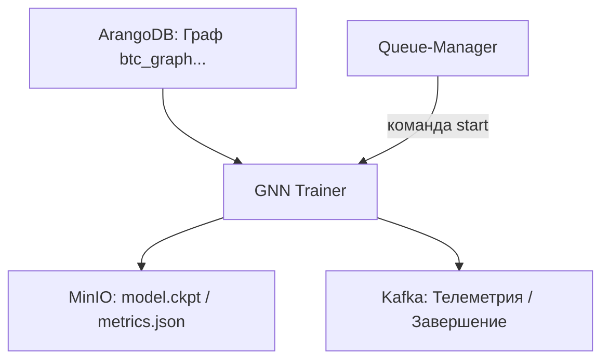

---

## 📘 Документация: `gnn-trainer` (StreamForge)

### 🧭 Назначение

Микросервис `gnn-trainer` отвечает за **обучение графовых нейронных сетей (GNN)** на основе графов, построенных `graph-builder`. Использует ArangoDB как источник графов, MinIO как хранилище чекпоинтов и результатов, и публикует телеметрию через Kafka.

---

### 📥 Пример команды запуска из `queue-manager`

```json
{
  "command": "start",
  "queue_id": "gnn-btcusdt-5m-2024_06_01-abc123",
  "target": "gnn-trainer",
  "symbol": "BTCUSDT",
  "type": "gnn_trainer",
  "graph_name": "btc_graph_5m_2024_06_01",
  "epochs": 10,
  "model_type": "GAT",
  "telemetry_id": "gnn-trainer__abc123",
  "image": "registry.dmz.home/streamforge/gnn-trainer:v0.1.0",
  "timestamp": 1722348000.123
}
```

---

### 📤 Пример телеметрии (`queue-events`)

```json
{
  "queue_id": "gnn-btcusdt-5m-2024_06_01-abc123",
  "telemetry_id": "gnn-trainer__abc123",
  "status": "started",
  "message": "Начато обучение GNN на графе btc_graph_5m_2024_06_01",
  "timestamp": 1722348010.456,
  "producer": "gnn-trainer__abc123"
}
```

```json
{
  "queue_id": "gnn-btcusdt-5m-2024_06_01-abc123",
  "telemetry_id": "gnn-trainer__abc123",
  "status": "finished",
  "message": "Обучение завершено. Acc: 0.91. Модель сохранена.",
  "timestamp": 1722348999.567,
  "producer": "gnn-trainer__abc123",
  "finished": true
}
```

---

### ⚙️ Переменные окружения

```dotenv
# ArangoDB (графы)
ARANGO_URL=http://abase-3.dmz.home:8529
ARANGO_DB=streamforge
ARANGO_USER=root
ARANGO_PASSWORD=...

# Kafka
KAFKA_BOOTSTRAP_SERVERS=k3-kafka-bootstrap.kafka:9093
KAFKA_USER=user-produser-tls
KAFKA_PASSWORD=...
CA_PATH=/usr/local/share/ca-certificates/ca.crt
QUEUE_EVENTS_TOPIC=queue-events
QUEUE_CONTROL_TOPIC=queue-control

# MinIO (чекпоинты, метрики)
MINIO_ENDPOINT=minio.dmz.home:9000
MINIO_ACCESS_KEY=minioadmin
MINIO_SECRET_KEY=minioadmin
MINIO_BUCKET=gnn-checkpoints

# Очередь / Задание
QUEUE_ID=gnn-btcusdt-5m-2024_06_01-abc123
SYMBOL=BTCUSDT
TYPE=gnn_trainer
GRAPH_NAME=btc_graph_5m_2024_06_01
EPOCHS=10
MODEL_TYPE=GAT
TELEMETRY_PRODUCER_ID=gnn-trainer__abc123
```

---

### 🧪 Параметры обучения (в сообщении)

| Поле         | Описание                                         |
| ------------ | ------------------------------------------------ |
| `graph_name` | Имя графа в ArangoDB (из graph-builder)          |
| `epochs`     | Кол-во эпох для обучения                         |
| `model_type` | Тип модели (GCN, GAT, GraphSAGE, и т.п.)         |
| `loss_fn`    | (опционально) loss-функция (например, BCE)       |
| `features`   | Какие признаки использовать (`RSI`, `VWAP`, ...) |
| `target`     | Целевая метка (например, `future_volatility`)    |

---

### 🧩 Потоки данных



---

### 📦 Выходы

* **MinIO**: model checkpoint (`.pt`, `.ckpt`), метрики (`metrics.json`)
* **Kafka**: телеметрия завершения
* **ArangoDB** (опц.): оценка качества (`graph_metadata`)

---

### 🔌 Особенности

* GNN библиотеки: `PyTorch Geometric`, `DGL`, `Spektral` — по конфигурации
* Поддержка нескольких графов (batched training)
* Асинхронный shutdown по Kafka-команде `stop`
* Возможность логирования графа в Neo4j (в будущем)

---


Хорошо! Начнём с **финальной версии подробной документации для `gnn-trainer`**. Я разобью её на части, начиная с:

---

## 📘 **GNN-Trainer — Микросервис обучения графовых моделей**

### 🧩 Назначение

`gnn-trainer` — это модуль микросервисной архитектуры **StreamForge**, предназначенный для:

* загрузки графовых данных из ArangoDB (по `graph_name`);
* обучения модели графовой нейросети (GNN) с заданными параметрами;
* сохранения результатов обучения в MinIO и публикации мета-данных в Kafka (`queue-events`).

---

### 🚀 Поддерживаемые GNN-фреймворки

| Фреймворк               | Поддержка      | Примечания              |
| ----------------------- | -------------- | ----------------------- |
| PyTorch Geometric (PyG) | ✅              | по умолчанию            |
| DGL                     | 🧪 планируется | optional (configurable) |

---

### 🛠️ Аргументы запуска (Kafka команда `start`)

```json
{
  "command": "start",
  "queue_id": "gnn-train-btcusdt-v3-2024-06-01-abc123",
  "target": "gnn-trainer",
  "graph_name": "btc_graph_5m_2024_06_01",
  "model_type": "GraphSAGE",
  "epochs": 20,
  "features": ["price_change", "volume", "rsi", "vwap"],
  "target": "price_up",
  "loss_fn": "binary_crossentropy",
  "telemetry_id": "gnn-trainer__abc123",
  "image": "registry.dmz.home/streamforge/gnn-trainer:v0.1.0",
  "timestamp": 1722346211.177
}
```

---

### 📦 Выходы (Outputs)

| Ресурс        | Формат/Тип      | Назначение                     |
| ------------- | --------------- | ------------------------------ |
| 🎯 Model      | `.ckpt` / `.pt` | модель сохраняется в MinIO     |
| 📈 Логи       | `.json`         | метрики (accuracy, loss и пр.) |
| 📡 Телеметрия | Kafka message   | `queue-events`                 |

---

### 🌐 Переменные окружения (.env)

```env
QUEUE_ID=gnn-train-btcusdt-v3-2024-06-01-abc123
TELEMETRY_PRODUCER_ID=gnn-trainer__abc123
GRAPH_NAME=btc_graph_5m_2024_06_01

# Kafka
KAFKA_BOOTSTRAP_SERVERS=k3-kafka-bootstrap.kafka:9093
KAFKA_USER=user-produser-tls
KAFKA_PASSWORD=...
CA_PATH=/usr/local/share/ca-certificates/ca.crt
QUEUE_EVENTS_TOPIC=queue-events
QUEUE_CONTROL_TOPIC=queue-control

# ArangoDB
ARANGO_URL=http://abase-3.dmz.home:8529
ARANGO_DB=streamforge
ARANGO_USER=root
ARANGO_PASSWORD=...

# MinIO (сохранение моделей)
MINIO_ENDPOINT=minio.dmz.home:9000
MINIO_ACCESS_KEY=streamforge
MINIO_SECRET_KEY=***
MINIO_BUCKET=models
```

---

## 🛰️ Формат телеметрии (Kafka Topic: `queue-events`)

Во время работы `gnn-trainer` отправляет сообщения в Kafka `queue-events`, описывая статус обучения, прогресс и результат. Пример:

```json
{
  "queue_id": "gnn-train-btcusdt-v3-2024-06-01-abc123",
  "status": "started",
  "message": "Запуск обучения GNN модели",
  "telemetry_id": "gnn-trainer__abc123",
  "graph_name": "btc_graph_5m_2024_06_01",
  "model_type": "GraphSAGE",
  "timestamp": 1722346211.177
}
```

🔁 В процессе обучения отправляются:

```json
{
  "queue_id": "gnn-train-btcusdt-v3-2024-06-01-abc123",
  "status": "training",
  "epoch": 5,
  "accuracy": 0.87,
  "loss": 0.213,
  "telemetry_id": "gnn-trainer__abc123",
  "timestamp": 1722346411.177
}
```

✅ По завершении:

```json
{
  "queue_id": "gnn-train-btcusdt-v3-2024-06-01-abc123",
  "status": "finished",
  "model_path": "s3://models/gnn-train-btcusdt-v3-2024-06-01-abc123.pt",
  "accuracy": 0.92,
  "loss": 0.138,
  "telemetry_id": "gnn-trainer__abc123",
  "timestamp": 1722347511.177
}
```

---

## 📊 Архитектура потока данных

```mermaid
graph TD
  A[Kafka: queue-control] --> B[gnn-trainer (GNN microservice)]
  B --> C[ArangoDB: графовые данные]
  B --> D[MinIO: модель (.pt)]
  B --> E[Kafka: queue-events]
  E --> F[UI / Monitor / Visualizer]
```

---

## 📋 Пример запуска (Swagger/OpenAPI style)

```json
POST /queues/start

{
  "command": "start",
  "queue_id": "gnn-train-btcusdt-v3-2024-06-01-abc123",
  "target": "gnn-trainer",
  "graph_name": "btc_graph_5m_2024_06_01",
  "model_type": "GraphSAGE",
  "features": ["price_change", "volume", "rsi", "vwap"],
  "target": "price_up",
  "loss_fn": "binary_crossentropy",
  "epochs": 20,
  "image": "registry.dmz.home/streamforge/gnn-trainer:v0.1.0",
  "telemetry_id": "gnn-trainer__abc123",
  "timestamp": 1722346211.177
}
```

---

## 🧪 Минимальный запуск из CLI (отладка без Kafka)

```bash
python main.py \
  --graph_name btc_graph_5m_2024_06_01 \
  --model_type GraphSAGE \
  --features price_change volume rsi vwap \
  --target price_up \
  --epochs 20 \
  --output_path /models/gnn_model.pt
```

---
